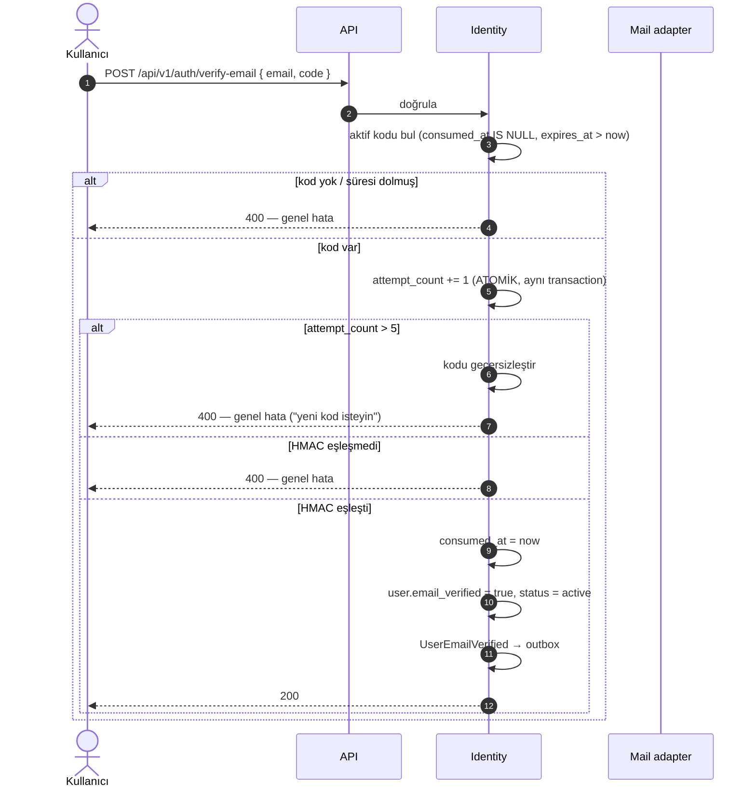
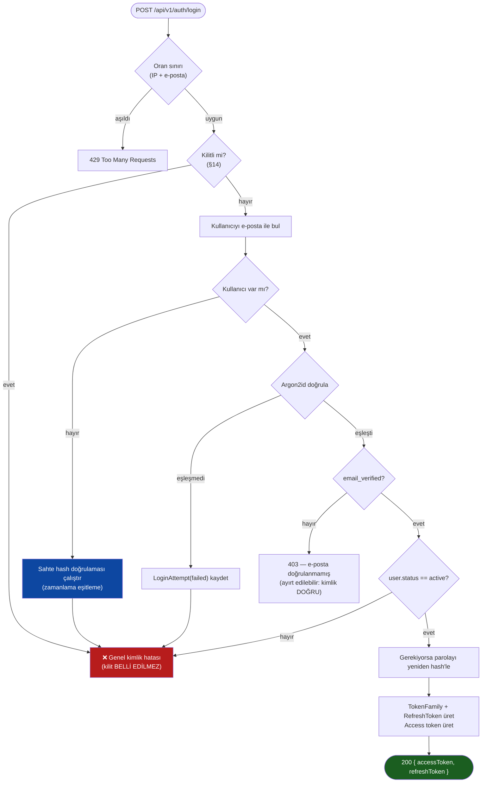
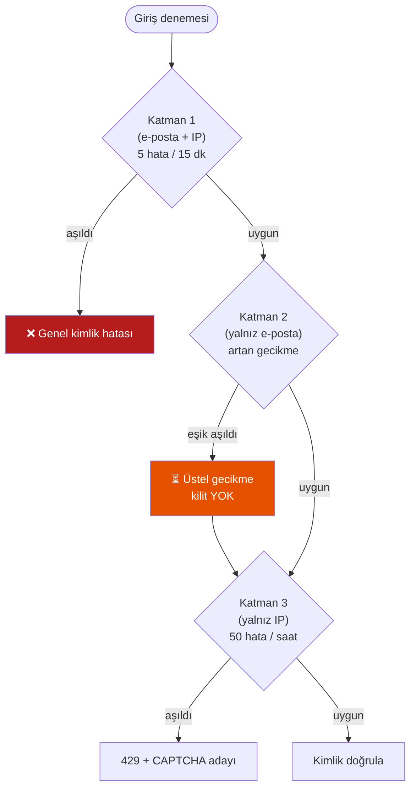
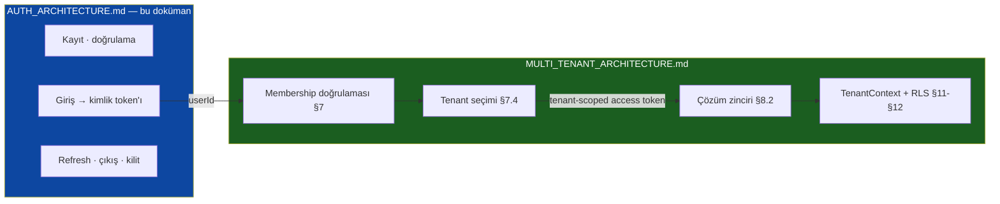

# Authentication Architecture

Business OS — Kimlik Doğrulama Mimarisi

> **Durum:** Faz 3 girişi — ✅ **Kabul edildi**
> **Sürüm:** 1.0
> **Son güncelleme:** 2026-07-21
> **Sahip:** Lead Software Engineer · **Onay:** Product Owner

---

## Bu dokümanın statüsü

Bu doküman, Business OS'un **kimlik doğrulama** tasarımı için Single Source of Truth'tur.

- Authentication ile ilgili bir soruda **önce buraya** bakılır.
- Kod ile bu doküman çelişirse, **doküman değil kod yanlıştır** — ya kod düzeltilir ya da doküman bilinçli bir kararla güncellenir.
- Bu dokümanı değiştiren her PR, karşılık gelen ADR'yi de günceller.

**Kardeş doküman:** [`MULTI_TENANT_ARCHITECTURE.md`](MULTI_TENANT_ARCHITECTURE.md) — tenant izolasyonu, Membership ve tenant çözümleme oradadır ve **burada tekrarlanmaz**. İki doküman [§17](#17-multi-tenancy-ile-i̇lişki)'de birleşir.

### Referans verilen ADR'ler

| ADR | Karar | Durum |
|---|---|---|
| [0004](../adr/0004-auth-own-module.md) | Authentication: kendi modülümüz, JWT + refresh rotation | ✅ Kabul edildi |
| [0006](../adr/0006-event-transactional-outbox.md) | Event: Transactional Outbox | ✅ Kabul edildi |
| [0014](../adr/0014-global-user-membership.md) | Global User + Membership | ✅ Kabul edildi |
| [0015](../adr/0015-tenant-resolution.md) | Tenant Resolution — Hybrid | ✅ Kabul edildi |
| [0016](../adr/0016-tenant-provisioning.md) | Tenant Provisioning — e-posta doğrulaması önce | ✅ Kabul edildi |
| [0017](../adr/0017-password-hashing-argon2id.md) | Parola saklama: Argon2id parametreleri | ✅ Kabul edildi |
| [0018](../adr/0018-password-policy.md) | Parola politikası | ✅ Kabul edildi |
| [0019](../adr/0019-email-verification-code.md) | E-posta doğrulama: 6 haneli kod | ✅ Kabul edildi |
| [0020](../adr/0020-jwt-structure-and-signing.md) | JWT yapısı ve imzalama (iki aşamalı token, EdDSA) | ✅ Kabul edildi |
| [0021](../adr/0021-refresh-token-rotation.md) | Refresh rotation + yeniden kullanım tespiti | ✅ Kabul edildi |
| [0022](../adr/0022-brute-force-protection.md) | Kaba kuvvet koruması — katmanlı kilit | ✅ Kabul edildi |
| [0023](../adr/0023-session-termination.md) | Oturum sonlandırma ve iptal | ✅ Kabul edildi |
| [0024](../adr/0024-password-reset.md) | Parola sıfırlama | ✅ Kabul edildi |

---

## 0. Çözülen çelişkiler ve sonuçları

Bu doküman yazılırken, Faz 2'de üretilmiş kod ve dokümanlarla **altı çelişki/boşluk** tespit edildi. Hepsi Product Owner tarafından karara bağlandı. Bölüm silinmedi çünkü **her kararın hangi alternatifin yerine seçildiğini** kaydeder — ve hangi başka dokümanların bu yüzden değiştiğini gösterir.

| # | Karar | Etkilenen doküman |
|---|---|---|
| Ç1 | **Seçenek B** — iki aşamalı token | Bu doküman §10 · MT §7.4 **güncellendi** |
| Ç2 | **6 haneli kod** (bağlantı değil) | Bu doküman §7 · MT §9.2 **güncellendi** · ADR-0016 **güncellendi** |
| Ç3 | `resolve_tenant` ile **aynı dar erişim deseni** | Bu doküman §13.2 · MT §12.4 **güncellendi** |
| Ç4 | **Ayrı `platform.identity_outbox`** tablosu | Bu doküman §15.1 |
| Ç5 | Identity tabloları **istisna listesine eklendi** | MT §12.4 **güncellendi** |
| Ç6 | `TenantContext` Faz 3'te tamamlanacak | Planlı — çelişki değil |

### Ç1 · ✅ Access token tenant taşır — ama iki aşamada

**Görev tanımı** şunu diyor: *"Access token içeriği: userId, hangi claim'ler — Membership/tenant bilgisi taşımayacağını unutma."*

**Ama Faz 2'de yazılan ve test edilen tasarım bunun tersini gerektiriyor:**

| Kaynak | Ne diyor |
|---|---|
| [MT §7.4](MULTI_TENANT_ARCHITECTURE.md) | *"Bir token, bir tenant. Bir access token tam olarak tek bir `tenant_id` claim'i taşır."* |
| MT §8.2 adım 4 | *"JWT doğrulanır; `claimTenantId` ve `userId` çıkarılır"* |
| MT §10 adım 3 | *"JWT imza + süre → `claimTenantId` · `userId` — GÜVENLİK SINIRI"* |
| MT §14.2 **I4** | *"`tenant_id` yalnızca doğrulanmış JWT claim'inden gelir"* |
| MT P1 | *"Tenant kimliğinin tek meşru kaynağı doğrulanmış JWT claim'idir"* |

Token tenant taşımazsa, `SET LOCAL app.current_tenant_id` değerinin kaynağı kalmaz. Geriye yalnızca `Host` başlığı kalır — ki bu **tam olarak P1'in yasakladığı şeydir** ve tüm RLS modelini geçersiz kılar.

**Üç olası okuma var:**

| # | Okuma | Sonuç |
|---|---|---|
| **A** | Token **rol/izin/membership listesi** taşımaz, ama `tenant_id` taşır | Faz 2 ile **tam uyumlu**. Muhtemelen kastedilen bu |
| **B** | **İki token biçimi:** giriş sonrası *tenant'sız kimlik token'ı*, tenant seçildikten sonra *tenant'lı access token* | Faz 2 ile uyumlu (§7.4'ün `switch-tenant` akışı zaten bunu ima ediyor). En temiz model |
| **C** | Access token **hiç** tenant taşımaz | Faz 2 tasarımı ve RLS **çöker**. Yeniden mimari gerekir |

> **KARAR: B.** Hem "token tenant *seçmez*" gereksinimini hem MT §7.4'ü ("bir token, bir tenant") karşılar: **token tenant seçmez; tenant seçimi membership doğrulamasıyla olur ve sonucu token'a yazılır.**
>
> `MULTI_TENANT_ARCHITECTURE.md` §7.4 bu karara göre güncellendi (sürüm 1.9). MT §8.2, §10, §11 ve §14.2 **değişmedi** — hepsi zaten "doğrulanmış claim" diyor ve iki aşamalı model bunu bozmuyor: tenant-scoped access token o claim'i taşımaya devam ediyor.

### Ç2 · ✅ E-posta doğrulama: 6 haneli kod

MT §9.2 akış diyagramı ve [ADR-0016](../adr/0016-tenant-provisioning.md) **bağlantı tabanlı** doğrulama gösteriyor:

```
V->>API: GET /api/v1/auth/verify?token=...
OB->>MAIL: doğrulama bağlantısı gönder
```

Görev tanımı ise **6 haneli kod** istiyor. İkisi aynı anda doğru olamaz.

> **KARAR: 6 haneli kod** ([§7](#7-e-posta-doğrulama)). MT §9.2 diyagramı ve ADR-0016'nın akış bölümü buna göre **güncellendi**.
>
> Kod seçilmesinin bağlantıya göre iki somut üstünlüğü var: mobil/masaüstü uygulama arasında geçiş gerektirmez (bağlantı, e-posta istemcisinin tarayıcısında açılır ve oturumu böler), ve tek kullanımlık bağlantıların e-posta tarayıcıları tarafından **önceden tıklanması** sorununu yaşamaz. Bedeli: kod kaba kuvvete açıktır ve bu yüzden [§7.3](#73-deneme-sınırı--kodun-kendisi-de-korunmalı)'teki deneme sınırı **zorunludur**, opsiyonel değil.

### Ç3 · ✅ `users` tablosu: dar ve kontrollü erişim

MT §12.4, `platform.users` için şunu yazıyor:

> *"**Doğrudan sorgulanmaz.** Erişim daima `memberships` (RLS korumalı) üzerinden `JOIN` ile."*

Ama **login, e-posta ile kullanıcı arar ve o anda hiçbir tenant context'i yoktur** — kullanıcının hangi tenant'a ait olduğu henüz bilinmiyor, zaten hiçbirine ait olmayabilir.

Bu, Faz 2'de `resolve_tenant` ile karşılaştığımız problemin **birebir aynısı**: context'i kuracak olan sorgu context'e dayanamaz.

> **KARAR:** `resolve_tenant` ile aynı desen — `platform.users` tenant-scoped bir tablo değildir (tenant'ların *üstünde* yaşar) ve erişim **dar bir yüzeyden** yapılır: yalnızca `findByEmail` / `findById`, **listeleme metodu yok**. Ayrıntı [§13.2](#132-users-tablosu-ve-rls). MT §12.4 **güncellendi**.

### Ç4 · ✅ Identity event'leri için ayrı outbox

MT §15.1: *"Tek istisna… `UserRegistered` / `UserEmailVerified` event'leridir; bunlar `tenantId: null` taşır."*

Ama Faz 2'de yazılan `platform.outbox` tablosunda `tenant_id NOT NULL`'dur ve `OutboxEventPublisher` tenant'sız event'i **açıkça reddeder** (bu bilinçliydi ve testi var).

> **KARAR: (b) — ayrı `platform.identity_outbox` tablosu.**
>
> Reddedilen alternatifler: **(a)** `tenant_id`'yi nullable yapıp politikayı `tenant_id IS NULL OR …` diye gevşetmek — bu, **herkesin** tenant'sız satır yazabilmesi demektir ve mevcut izolasyon garantisini zayıflatır. **(c)** Identity event'lerini in-process yayınlamak — ADR-0006'yı ihlal eder ("commit oldu, event kayboldu" hatasını geri getirir).
>
> Ayrıntı [§15](#15-domain-events).

### Ç5 · ✅ Identity tabloları istisna listesine eklendi

`platform.users`, `platform.refresh_tokens`, `platform.email_verification_codes`, `platform.login_attempts` — hiçbiri tenant-scoped değil. MT §14.2 **I9** diyor ki: *"Platform tablosu istisna listesi dışında tenant-scoped olmayan tablo yoktur."*

> **KARAR:** MT §12.4 tablosuna Identity tabloları gerekçesi ve telafi edici kontrolüyle **eklendi** (sürüm 1.9). I9 korunuyor.

### Ç6 · ✅ `TenantContext` Faz 3'te tamamlanacak

MT §11.2 beş alan tarif ediyor: `tenantId` · `userId` · `role` · `correlationId` · `source`. Faz 2'de yalnızca `tenantId` (+ `db`) taşınıyor. `userId` ve `role` bu modülden gelecek.

> Bu bir çelişki değil, **planlı bir tamamlanma**. Faz 3'te kapanır.

---

## İçindekiler

1. [Purpose](#1-purpose)
2. [Scope](#2-scope)
3. [Goals / Non-Goals](#3-goals--non-goals)
4. [Design Principles](#4-design-principles)
5. [Domain Model](#5-domain-model)
6. [Parola Politikası ve Hash'leme](#6-parola-politikası-ve-hashleme)
7. [E-posta Doğrulama ve Parola Sıfırlama](#7-e-posta-doğrulama)
8. [Kayıt Akışı](#8-kayıt-akışı)
9. [Giriş Akışı](#9-giriş-akışı)
10. [JWT Yapısı](#10-jwt-yapısı)
11. [Refresh ve Rotation](#11-refresh-ve-rotation)
12. [Çıkış ve İptal](#12-çıkış-ve-i̇ptal)
13. [Veri Modeli ve RLS İlişkisi](#13-veri-modeli-ve-rls-i̇lişkisi)
14. [Kaba Kuvvet Koruması](#14-kaba-kuvvet-koruması)
15. [Domain Events](#15-domain-events)
16. [Failure Handling](#16-failure-handling)
17. [Multi-Tenancy ile İlişki](#17-multi-tenancy-ile-i̇lişki)
18. [Future Extensions](#18-future-extensions)

---

## 1. Purpose

[ADR-0004](../adr/0004-auth-own-module.md) kimlik doğrulamayı **kendimiz yazmaya** karar verdi. O ADR'nin en dürüst cümlesi şuydu:

> *"**Güvenlik sorumluluğu tamamen bizde.** Token rotation, brute-force koruması, parola sıfırlama akışı, oturum iptali — hepsi doğru yazılmak zorunda."*

Bu doküman o sorumluluğun **karşılığıdır**: her bir mekanizmanın ne olduğunu, neden öyle olduğunu ve neyi koruduğunu tek yerde toplar.

Yanıtladığı sorular:

| Soru | Bölüm |
|---|---|
| Parola nasıl saklanır, hangi parametrelerle? | [§6](#6-parola-politikası-ve-hashleme) |
| E-posta nasıl doğrulanır, kod nasıl korunur? | [§7](#7-e-posta-doğrulama) |
| Token'da ne var, ne **yok** ve neden? | [§10](#10-jwt-yapısı) |
| Çalınan bir refresh token nasıl tespit edilir? | [§11](#11-refresh-ve-rotation) |
| Çıkış gerçekten oturumu bitirir mi? | [§12](#12-çıkış-ve-i̇ptal) |
| Biri başkasının hesabını kilitleyebilir mi? | [§14](#14-kaba-kuvvet-koruması) |
| Kimlik verisi tenant izolasyonuyla nasıl ilişkilenir? | [§13](#13-veri-modeli-ve-rls-i̇lişkisi), [§17](#17-multi-tenancy-ile-i̇lişki) |

---

## 2. Scope

### Kapsam içinde

Parola saklama · parola politikası · kayıt · e-posta doğrulama (6 haneli kod) · giriş · JWT üretimi ve doğrulaması · refresh rotation · çıkış ve iptal · kaba kuvvet koruması · **parola sıfırlama** · Identity domain event'leri · Identity tablolarının RLS ile ilişkisi.

### Kapsam dışında

| Konu | Nerede |
|---|---|
| Tenant izolasyonu, RLS, tenant context | [`MULTI_TENANT_ARCHITECTURE.md`](MULTI_TENANT_ARCHITECTURE.md) |
| Membership, rol, tenant değiştirme | Aynı doküman §7 |
| Tenant çözümleme zinciri | Aynı doküman §8 |
| RBAC / yetkilendirme (izin değerlendirme) | `ARCHITECTURE.md` §10.1, Faz 4 |
| MFA / SSO / SCIM | [§18](#18-future-extensions) |
| E-posta **gönderim altyapısı** (`EmailPort`, Resend adapter) | `ARCHITECTURE.md` §9.3 — bu doküman yalnızca *ne gönderildiğini* tanımlar |

---

## 3. Goals / Non-Goals

### Goals

| # | Hedef | Nasıl ölçülür |
|---|---|---|
| G1 | Parola veritabanı sızsa bile parolalar **pratik olarak kırılamaz** | Argon2id, güncel parametrelerle; hiçbir yerde düz veya hızlı-hash parola yok |
| G2 | Çalınan bir refresh token **tespit edilebilir** | Yeniden kullanım tespiti, ailenin tümünü iptal eder |
| G3 | Çıkış **sunucuda** gerçekleşir | Refresh token DB'den silinir; sadece istemci temizliği yeterli sayılmaz |
| G4 | Kaba kuvvet hem **online** hem **hedefli DoS** açısından sınırlıdır | Katmanlı kilit; tek bir e-postayı kilitleyerek servis dışı bırakmak mümkün değil |
| G5 | Hiçbir uç nokta **hesabın varlığını sızdırmaz** | Kayıt, giriş, doğrulama yanıtları ayırt edilemez; süre sabitlenmiş |
| G6 | Token'lar **bayat yetki taşımaz** | Rol ve membership her istekte doğrulanır, token'dan okunmaz |

### Non-Goals (V1'de bilinçli olarak yapılmıyor)

| # | Yapılmayan | Neden | Ne zaman |
|---|---|---|---|
| N1 | **MFA / 2FA** | Temel akış oturmadan ikinci faktör eklemek, iki yarım sistem üretir | Faz 4+ |
| N2 | **SSO / SAML / OIDC** | ADR-0004 bunu federasyon port'u olarak öngörüyor | Kurumsal talep |
| ~~N3~~ | ~~Parola sıfırlama~~ | **Kapsama alındı** — parolasını unutan kullanıcı için kurtarma yolu olmaması kabul edilemez ([ADR-0024](../adr/0024-password-reset.md), [§7.6](#76-parola-sıfırlama)) | — |
| N4 | **"Beni hatırla" / kalıcı oturum** | Refresh token ömrü zaten bu ihtiyacı karşılıyor | — |
| N5 | **Access token deny-list** | Her istekte ek arama maliyeti; kısa TTL yeterli ([§12.3](#123-access-tokenin-i̇ptal-edilemezliği)) | Ölçek gerektirirse |
| N6 | **Parola geçmişi / periyodik zorunlu değişim** | NIST SP 800-63B bunları **önermiyor**; kullanıcıyı zayıf kalıplara iter | Gündeme alınmayacak |
| N7 | **Cihaz/oturum yönetimi arayüzü** | Veri modeli destekliyor, arayüz sonra | Faz 4 |

---

## 4. Design Principles

### P1 — Kimlik verisi en hassas varlıktır

Parola hash'i, refresh token ve doğrulama kodu; loglara, hata mesajlarına, event payload'larına ve cache'e **hiçbir koşulda** girmez. `DEVELOPMENT_RULES.md` §8: *"Log'lara PII, token, şifre yazılmaz."*

### P2 — Yanıtlar hesabın varlığını sızdırmaz

Kayıt, giriş, kod doğrulama ve yeniden gönderme uçlarının yanıtı, hesap var olsa da olmasa da **aynıdır** — gövde, durum kodu ve *süre* olarak. Süre özellikle önemlidir: var olmayan kullanıcı için hash'leme atlanırsa, yanıt süresi hesabın varlığını ele verir.

### P3 — Token bir *iddia* taşır, *yetki* taşımaz

Token "bu istek şu kullanıcıya ait" der. "Bu kullanıcı şunu yapabilir" demez. Rol, membership ve tenant durumu **her istekte** doğrulanır ([MT §14.1 T4](MULTI_TENANT_ARCHITECTURE.md): *"Bayat izin = güvenlik açığı"*).

### P4 — Her sır, saklandığı yerde de korunur

Veritabanı sızıntısı bir *tek* hata olmamalıdır: parola Argon2id ile, refresh token hash'le, doğrulama kodu **pepper'lı HMAC** ile saklanır. Hiçbiri okunduğu gibi kullanılamaz.

### P5 — Fail closed

Doğrulanamayan bir önkoşul **karşılanmış sayılmaz**. Bu, Faz 2'de `TemporaryDenyProvisioningPolicy` ile zaten uygulanan ilkedir.

### P6 — Kimlik globaldir, oturum tenant'lıdır

`User` hiçbir tenant'a ait değildir ([ADR-0014](../adr/0014-global-user-membership.md)). Ama bir *oturum* daima tek bir tenant bağlamında çalışır ([MT §7.4](MULTI_TENANT_ARCHITECTURE.md)). Bu ayrım [§10](#10-jwt-yapısı)'un tamamını belirler.

---

## 5. Domain Model

### 5.1 Kavramlar

| Kavram | Tanım | Ömür |
|---|---|---|
| **User** | Sistemdeki bir insan. Global, tenant'tan bağımsız. | Kalıcı |
| **Credential** | Kullanıcının parola hash'i ve algoritma parametreleri. | Kalıcı, döndürülebilir |
| **EmailVerificationCode** | 6 haneli, tek kullanımlık, süreli doğrulama kodu. | Dakikalar |
| **RefreshToken** | Yeni access token üretme hakkı. Rotasyona tabi. | Günler |
| **TokenFamily** | Bir girişten doğan refresh token zinciri. Hırsızlık tespitinin birimi. | Oturum boyu |
| **LoginAttempt** | Başarısız giriş kaydı. Kilit kararının girdisi. | Saatler |

### 5.2 İlişki diyagramı

```mermaid
erDiagram
    USER ||--|| CREDENTIAL : "sahiptir"
    USER ||--o{ EMAIL_VERIFICATION_CODE : "doğrulanır"
    USER ||--o{ TOKEN_FAMILY : "oturum açar"
    TOKEN_FAMILY ||--o{ REFRESH_TOKEN : "zincir"
    USER ||--o{ LOGIN_ATTEMPT : "denenir"
    USER ||--o{ MEMBERSHIP : "üyedir"

    USER {
        uuid   id PK
        string email UK "normalize, global tekil"
        bool   email_verified
        string status "pending|active|locked|deactivated"
        ts     created_at
    }

    CREDENTIAL {
        uuid   user_id PK_FK
        string password_hash "argon2id, parametreler dahil"
        ts     password_changed_at
    }

    EMAIL_VERIFICATION_CODE {
        uuid   id PK
        uuid   user_id FK
        string code_hash "HMAC-SHA256 + pepper"
        int    attempt_count
        ts     expires_at
        ts     consumed_at "nullable"
    }

    TOKEN_FAMILY {
        uuid   id PK
        uuid   user_id FK
        string revoked_reason "nullable"
        ts     created_at
        ts     revoked_at "nullable"
    }

    REFRESH_TOKEN {
        uuid   id PK
        uuid   family_id FK
        string token_hash "SHA-256"
        ts     expires_at
        ts     used_at "nullable — rotasyonda dolar"
    }

    LOGIN_ATTEMPT {
        uuid   id PK
        string email_normalized "indexli"
        string ip_address
        bool   succeeded
        ts     attempted_at
    }

    MEMBERSHIP {
        uuid tenant_id FK
        uuid user_id FK
        string role
    }
```

> `MEMBERSHIP` burada **yalnızca bağlamı göstermek için** vardır; sahibi Tenant modülüdür ve tanımı [MT §7](MULTI_TENANT_ARCHITECTURE.md)'dedir.

### 5.3 `Credential` neden `User`'dan ayrı

Üç sebep:

1. **Erişim yüzeyi.** Kullanıcı listeleme, profil okuma, membership sorgusu — hiçbiri parola hash'ine ihtiyaç duymaz. Ayrı tabloda tutmak, hash'in yanlışlıkla bir `SELECT *` ile dışarı çıkmasını zorlaştırır.
2. **Federasyon.** SSO eklendiğinde ([N2](#non-goals-v1de-bilinçli-olarak-yapılmıyor)) parolası **olmayan** kullanıcılar olacaktır. `User`'da nullable bir `password_hash`, "parola yok mu, yoksa silinmiş mi?" belirsizliği üretir.
3. **Denetim.** `password_changed_at` ayrı bir yaşam döngüsüdür ve `User`'ın `updated_at`'iyle karışmamalıdır.

---

## 6. Parola Politikası ve Hash'leme

### 6.1 Politika

| Kural | Değer | Gerekçe |
|---|---|---|
| Minimum uzunluk | **8 karakter** | Görev tanımında onaylı |
| **Maksimum uzunluk** | **128 karakter** | **DoS önlemi** — aşağıda |
| Bileşim | En az **bir harf + bir rakam** | Görev tanımında onaylı |
| Büyük/küçük harf, sembol zorunluluğu | **Yok** | NIST SP 800-63B: karmaşıklık kuralları kullanıcıyı `P@ssw0rd1` gibi tahmin edilebilir kalıplara iter |
| Periyodik zorunlu değişim | **Yok** | Aynı gerekçe ([N6](#non-goals-v1de-bilinçli-olarak-yapılmıyor)) |
| Uzunluk sayımı | **Kod noktası** (byte değil) | `é` veya emoji içeren parola, byte sayımıyla haksız yere reddedilirdi |
| Normalizasyon | **NFKC**, hash'lemeden önce | Aynı parola farklı Unicode normalizasyonlarıyla yazıldığında giriş başarısız olmamalı |

> **Maksimum uzunluk neden var:** Argon2id'nin maliyeti girdi uzunluğundan görece bağımsızdır, ama **girdiyi belleğe almak ve normalize etmek** değildir. 10 MB'lık bir "parola" gönderen istemci, kimlik doğrulaması **yapılmadan** sunucuda bellek ve CPU harcatır. Giriş uç noktası tanımı gereği kimliksizdir; oradaki her maliyet bir saldırı yüzeyidir. 128 karakter, en uzun makul parola cümlesinin çok üzerindedir.

### 6.2 Argon2id parametreleri

```
type        = Argon2id
memoryCost  = 19456 KiB   (19 MiB)
timeCost    = 2
parallelism = 1
hashLength  = 32 byte
saltLength  = 16 byte     (rastgele, kullanıcı başına)
```

**Neden Argon2id (Argon2i veya Argon2d değil):** Argon2d GPU'ya dirençlidir ama yan kanal saldırılarına açıktır; Argon2i tersi. Argon2id ikisini birleştirir ve OWASP/RFC 9106'nın önerdiği varyanttır.

**Neden bu değerler:** OWASP Password Storage Cheat Sheet'in `m=19 MiB, t=2, p=1` yapılandırması. Bellek maliyeti, GPU/ASIC ile paralel kırma denemelerini pahalı kılan asıl parametredir — iterasyon sayısını artırmak yerine belleği artırmak daha etkilidir.

> **Dürüst bedeli ve zorunlu adım:** Bu değerler bir **taban**dır, hedef değil. Üretim donanımında ölçülmeli ve tek bir hash **~100–250 ms** sürecek şekilde yukarı çekilmelidir. Ama bu bir denge işidir: hash maliyeti aynı zamanda **kendi sunucumuza karşı bir DoS vektörüdür**, çünkü giriş uç noktası kimliksizdir. 500 ms'lik bir hash, saniyede 20 sahte giriş isteğiyle bir CPU çekirdeğini doldurur.
>
> Bu yüzden parametre seçimi [§14](#14-kaba-kuvvet-koruması)'teki oran sınırlamasıyla **birlikte** kararlaştırılır; ayrı ayrı optimize edilemezler.

### 6.3 Saklama kuralları

- Hash, **parametreleri kendi içinde taşıyan** PHC string formatında saklanır (`$argon2id$v=19$m=19456,t=2,p=1$…`). Böylece parametreler ileride artırıldığında eski hash'ler hâlâ doğrulanabilir.
- **Kademeli yeniden hash'leme:** Kullanıcı başarıyla giriş yaptığında, hash'i eski parametrelerle üretilmişse — o an elimizde düz parola varken — yenisiyle **sessizce** güncellenir. Bu, parametre yükseltmesinin tek pratik yoludur; aksi halde eski hash'ler sonsuza kadar zayıf kalır.
- Parola hash'i hiçbir DTO'ya, event'e veya log'a **girmez**.

---

## 7. E-posta Doğrulama

### 7.1 Kod üretimi ve saklanması

| Özellik | Karar |
|---|---|
| Biçim | **6 hane**, `000000`–`999999` |
| Üretim | Kriptografik olarak güvenli RNG (`crypto.randomInt`), **düzgün dağılımlı** |
| Ömür | **15 dakika** |
| Kullanım | **Tek kullanımlık** — doğrulanınca `consumed_at` dolar |
| Aynı anda geçerli kod | **Bir tane** — yeni kod istendiğinde önceki geçersizleşir |
| Saklama | **HMAC-SHA256 + sunucu tarafı pepper** |

**Neden `Math.random()` değil:** Öngörülebilir bir üreteç, kodu tahmin edilebilir kılar ve tüm mekanizmayı anlamsızlaştırır.

**Neden 15 dakika (10 değil):** E-posta teslimatı gecikebilir; spam klasörünü kontrol etmek zaman alır. 10 dakika, yavaş teslimat durumunda kullanıcıyı ikinci koda zorlar ve destek yüküne dönüşür. 15 dakika, kaba kuvvet penceresi açısından hâlâ dardır — çünkü asıl koruma deneme sınırıdır, süre değil.

### 7.2 Kod neden hash'lenerek saklanır — ve neden Argon2 ile değil

| Yaklaşım | Değerlendirme |
|---|---|
| **Düz sakla** | ❌ Veritabanı okuma yetkisi olan herkes doğrudan hesap ele geçirir. Yedek dosyası, log, hatalı bir `SELECT` — hepsi yeterli |
| **Düz SHA-256** | ❌ Arama uzayı yalnızca **10⁶**. Sızan bir hash, sıradan bir makinede **milisaniyeler** içinde geri çevrilir. Hash'lemek burada neredeyse hiçbir şey kazandırmaz |
| **Argon2id** | ⚠️ Güvenli ama **yanlış araç**: her doğrulama denemesinde 100+ ms maliyet, ve kod zaten kısa ömürlü + deneme sınırlı |
| **HMAC-SHA256 + pepper** | ✅ **Önerilen** |

**Pepper**, veritabanında **olmayan** bir sunucu sırrıdır (env/secret manager). Sonuç: sızan bir veritabanı tek başına yetmez — saldırganın uygulama sırrına da erişmesi gerekir. Ve online tahmin zaten [§7.3](#73-deneme-sınırı--kodun-kendisi-de-korunmalı) ile kapalıdır.

> Bu, parola ile kodun **farklı tehdit modelleri** olduğunun kabulüdür: parola düşük entropili ve uzun ömürlüdür (yavaş KDF şart); kod yüksek oranda kısıtlı, tek kullanımlık ve dakikalar ömürlüdür (hızlı MAC + pepper yeterli).

### 7.3 Deneme sınırı — kodun kendisi de korunmalı

**Bu, tasarımın en kritik parçasıdır.** 6 haneli bir kod yalnızca **1.000.000** olasılıktır. Deneme sınırı olmadan, saniyede birkaç yüz istek gönderen bir saldırgan kodu **dakikalar içinde** bulur ve mekanizma tümüyle anlamsızlaşır.

| Kural | Değer |
|---|---|
| Kod başına maksimum yanlış deneme | **5** |
| 5. yanlış denemede | Kod **geçersizleşir**; kullanıcı yeni kod istemek zorundadır |
| Sayaç nerede | Kod satırında (`attempt_count`), **atomik artırma** ile |
| Yanıt | Doğru/yanlış/tükenmiş — istemciye **ayırt edilmeyen** genel bir hata |

> **Atomik artırma neden önemli:** Sayaç "oku → karşılaştır → yaz" biçiminde artırılırsa, eşzamanlı 100 istek 100 denemeyi **1 sayılmış** gibi geçirebilir. Sayaç, doğrulama sorgusuyla **aynı transaction'da** ve `UPDATE … SET attempt_count = attempt_count + 1` biçiminde artırılmalıdır.

### 7.4 Yeniden gönderme (resend) sınırı

| Kural | Değer | Neden |
|---|---|---|
| Ardışık iki gönderim arası | **60 saniye** | Kullanıcı "gelmedi" diye üst üste basar; e-posta sağlayıcısı bunu spam sayar ve alan adı itibarımız düşer |
| Saatlik üst sınır (hesap başına) | **5** | Deneme sınırını "yeni kod al" ile sıfırlamak, sınırı anlamsız kılardı |
| Saatlik üst sınır (IP başına) | **20** | Toplu kayıt/e-posta bombardımanı |

> **Kaçırılırsa oluşan açık:** Yeniden gönderme sınırsız olsaydı, saldırgan her 5 denemede yeni kod isteyerek **sınırsız** deneme yapabilirdi. Deneme sınırı ile yeniden gönderme sınırı **birlikte** çalışır; biri olmadan diğeri yetersizdir.

### 7.5 Akış



> Doğrulama başarılı olduğunda kullanıcı **hâlâ hiçbir tenant'a ait değildir**. Tenant açma ayrı bir adımdır ([ADR-0016](../adr/0016-tenant-provisioning.md)).

### 7.6 Parola sıfırlama

Aynı kod deseni yeniden kullanılır ([ADR-0024](../adr/0024-password-reset.md)) — ama **daha sıkı parametrelerle**, çünkü tehdit modeli farklıdır: doğrulama kodu bir hesabı *aktive eder*, sıfırlama kodu bir hesabı **ele geçirmeye yeter**.

| Parametre | Doğrulama | **Sıfırlama** | Neden farklı |
|---|---|---|---|
| Kod ömrü | 15 dk | **10 dk** | Pencere ne kadar darsa o kadar iyi |
| Yanlış deneme | 5 | **3** | Ele geçirme riski daha yüksek |
| Resend bekleme | 60 sn | **120 sn** | E-posta bombardımanı bir taciz aracıdır |
| Saklama | HMAC + pepper | **Aynı** | |

**Sıfırlama tamamlandığında zorunlu yan etkiler:**

1. Kullanıcının **tüm refresh aileleri iptal edilir** ([§12.2](#122-i̇ptal-nedenleri)) — parola sıfırlama, "hesabım ele geçirilmiş olabilir" senaryosunun ana kurtarma yoludur; eski oturumların ayakta kalması bunu anlamsız kılar.
2. Aktif tüm sıfırlama kodları geçersizleşir.
3. Hesaba **bilgilendirme e-postası** gönderilir ("parolan değiştirildi") — sıfırlamayı *yapan* kişi zaten biliyor; bu e-posta, **yapmayan** kişi için vardır.

> **`Ç2` ile aynı gizlilik kuralı:** sıfırlama talebi yanıtı, e-posta kayıtlı olsun olmasın **aynıdır**. Aksi halde uç nokta bir hesap varlık oracle'ına döner ([P2](#p2--yanıtlar-hesabın-varlığını-sızdırmaz)).

### 7.7 E-posta gönderimi — `EmailPort`

Bu dokümandaki üç akış (doğrulama, sıfırlama, güvenlik bildirimleri) e-posta gönderimine bağımlıdır. Gönderim **sağlayıcıdan bağımsız** bir port arkasındadır — `LLMPort`, `StoragePort` ve `CachePort` ile aynı desen (`ARCHITECTURE.md` §9.3).

| Katman | Ne |
|---|---|
| Port | `EmailPort.send(message)` |
| Üretim adapter'ı | **Resend** |
| Lokal / CI adapter'ı | Konsol veya dosya — e-posta gönderilmez, içerik loglanır |

**Bu dokümanı ilgilendiren üç kural:**

1. **Gönderim domain event üzerinden tetiklenir**, use case doğrudan `send()` çağırmaz. Aksi hâlde iki yönlü tutarsızlık doğar: ya DB commit olur e-posta gitmez, ya e-posta gider ama transaction geri alınır ve kullanıcı **var olmayan bir kod** alır.
2. **Kod, token ve parola hiçbir log satırına girmez.** E-posta gövdesi tanımı gereği sır taşır ([P1](#p1--kimlik-verisi-en-hassas-varlıktır)).
3. **Teslimat hatası kullanıcıya sızdırılmaz.** "Kod gönderildi" yanıtı teslimatın başarısından bağımsız olarak aynıdır — aksi hâlde yanıt farkı hesabın varlığını ele verir ([P2](#p2--yanıtlar-hesabın-varlığını-sızdırmaz)).

> **Sağlayıcı bir adapter detayıdır.** Resend'in ücretsiz kotası yetmez veya fiyatlandırması değişirse, yeni bir adapter yazmak dışında bu dokümandaki hiçbir akış değişmemelidir.

---

## 8. Kayıt Akışı

```mermaid
sequenceDiagram
    autonumber
    actor V as Ziyaretçi
    participant API as API
    participant ID as Identity
    participant OB as Outbox
    participant MAIL as Mail adapter

    V->>API: POST /api/v1/auth/register { email, password }
    API->>API: Zod doğrulaması (biçim, uzunluk)
    API->>ID: register

    rect rgb(60,30,30)
    Note over ID: ── TEK TRANSACTION ──
    ID->>ID: e-posta normalize (lowercase + NFKC)
    ID->>ID: User(status=pending, email_verified=false)
    ID->>ID: Credential(argon2id hash)
    ID->>ID: EmailVerificationCode(HMAC, 15 dk)
    ID->>OB: UserRegistered → outbox
    Note over ID: ── COMMIT ──
    end

    ID-->>V: 202 — "Kod gönderildi" (HER ZAMAN aynı yanıt)
    OB->>MAIL: 6 haneli kodu gönder
```



### 8.1 Kritik kurallar

| Kural | Gerekçe |
|---|---|
| **Yanıt her zaman aynıdır** — e-posta kayıtlı olsa da olmasa da | Aksi halde uç nokta bir *hesap varlık oracle*'ına döner ([P2](#p2--yanıtlar-hesabın-varlığını-sızdırmaz)) |
| E-posta zaten kayıtlıysa **yeni kullanıcı oluşturulmaz**, ama yanıt değişmez | Var olan hesaba "birisi seninle kayıt olmaya çalıştı" bilgi e-postası gönderilebilir |
| Kullanıcı + credential + kod + event **tek transaction** | Parolasız kullanıcı veya kodsuz bekleyen hesap oluşamaz |
| E-posta **normalize edilir** (lowercase + NFKC) ve öyle saklanır | `Ali@x.com` ile `ali@x.com` aynı hesaptır; aksi halde tekillik kısıtı atlatılabilir |
| Kayıt **hiçbir tenant oluşturmaz** | [ADR-0016](../adr/0016-tenant-provisioning.md) |

> **Nokta/artı normalizasyonu yapılmaz.** Gmail'in `a.b@gmail.com` ≡ `ab@gmail.com` davranışı sağlayıcıya özgüdür; genelleştirmek başka sağlayıcılarda **farklı kişileri aynı hesaba** düşürür. Bu bilinçli bir sınırdır.

---

## 9. Giriş Akışı



### 9.1 İki incelik

**Sahte hash doğrulaması.** Kullanıcı bulunamadığında hash'leme atlanırsa yanıt **belirgin biçimde** daha hızlı döner ve saldırgan hangi e-postaların kayıtlı olduğunu **zamanlamayla** öğrenir. Bu yüzden kullanıcı yoksa da sabit bir sahte hash'e karşı Argon2id çalıştırılır.

**`email_verified` hatası neden ayırt edilebilir.** Diğer tüm hatalar genel bir mesaj döner, ama bu biri farklıdır — çünkü buraya ulaşmak için **parola doğru bilinmiş** olmalıdır. Kimliğini kanıtlamış bir kullanıcıya "e-postanı doğrula" demek bilgi sızdırmaz; aksine, demezsek kullanıcı neden giremediğini anlayamaz.

---

## 10. JWT Yapısı

> **`[Ç1]`** Bu bölüm [Ç1](#ç1--🔴-access-token-tenant-taşıyacak-mı-bloke-edici)'in **B okumasıyla** yazılmıştır: iki token biçimi. Karar değişirse bu bölüm ve MT §7.4/§8.2/§10 birlikte güncellenmelidir.

### 10.1 İki token biçimi

| Biçim | Ne zaman | `tenant` claim'i | Ne yapabilir |
|---|---|---|---|
| **Kimlik token'ı** | Giriş sonrası | **Yok** | Yalnızca "hangi tenant'lara üyeyim" sorgusu ve tenant seçimi |
| **Tenant-scoped access token** | Tenant seçildikten sonra | **Var** | Tenant verisine erişim |

**Neden iki biçim:** Kullanıcı birden fazla tenant'a üye olabilir ([ADR-0014](../adr/0014-global-user-membership.md)) ve giriş anında hangisini istediği **bilinmez**. Tek biçim olsaydı, ya giriş bir tenant tahmin etmek zorunda kalırdı ya da tenant kimliği token dışından gelirdi — ikincisi [MT P1](MULTI_TENANT_ARCHITECTURE.md)'in ihlali olurdu.

Tenant seçimi [MT §7.4](MULTI_TENANT_ARCHITECTURE.md)'teki `switch-tenant` akışıdır ve **membership doğrulamasından geçer**. Bu doküman o akışı tekrarlamaz.

### 10.2 Access token içeriği

```json
{
  "iss": "https://api.businessos.com",
  "aud": "businessos-api",
  "sub": "018f3a2b-...",
  "sid": "018f3a2b-...",
  "tenant": "018f3a2b-...",
  "typ": "access",
  "jti": "018f3a2b-...",
  "iat": 1784650000,
  "exp": 1784650900
}
```

| Claim | Anlamı |
|---|---|
| `sub` | Kullanıcı kimliği (global) |
| `sid` | Token ailesi (oturum) kimliği — iptal ve denetim izi için |
| `tenant` | Seçilmiş tenant. **Kimlik token'ında bulunmaz.** RLS anahtarının kaynağıdır |
| `typ` | `access` \| `identity` — biçim karışıklığını önler |
| `jti` | Benzersiz token kimliği; denetim ve (gerekirse) deny-list için |

### 10.3 Token'da **olmayanlar** — ve neden

| Taşınmayan | Neden |
|---|---|
| **Rol / izinler** | [P3](#p3--token-bir-iddia-taşır-yetki-taşımaz). Rol değişince token bayatlar; kullanıcı yetkisi alındıktan sonra da eski rolüyle çalışmaya devam ederdi. [MT §14.1 T4](MULTI_TENANT_ARCHITECTURE.md): *"Bayat izin = güvenlik açığı"* |
| **Membership listesi** | Hem bayatlar hem token'ı şişirir; her istekte cookie/header boyutu maliyeti |
| **E-posta / ad** | PII'yi her istekte ağda ve loglarda dolaştırmak; JWT **şifreli değildir**, yalnızca imzalıdır |
| **`emailVerified`** | Doğrulama durumu değişebilir; kaynak DB'dir |

> **JWT şifreli değildir.** Base64 çözen herkes payload'ı okur. Bu yüzden içine konan her alan, "istemcinin görmesi sakıncasız mı?" sorusundan geçmelidir.

### 10.4 Ömür ve imzalama

| Parametre | Değer | Gerekçe |
|---|---|---|
| Access token ömrü | **15 dakika** | Çalınan token'ın kullanım penceresi. Kısaltmak refresh trafiğini artırır; 15 dk yaygın ve dengeli |
| Kimlik token'ı ömrü | **5 dakika** | Tek işi tenant seçtirmek; uzun yaşamasına gerek yok |
| Refresh token ömrü | **30 gün** (mutlak) | [§11](#11-refresh-ve-rotation) |

**İmzalama algoritması: EdDSA (Ed25519)** — [ADR-0020](../adr/0020-jwt-structure-and-signing.md).

| Seçenek | Değerlendirme |
|---|---|
| HS256 (simetrik) | Bugün en basit: tek servis, tek sır. Ama doğrulayan **her** servis sırrı bilir; mikroservise geçişte her servis token **üretebilir** hâle gelir |
| **EdDSA / Ed25519** (asimetrik) | ✅ **Seçildi.** Yalnızca Identity özel anahtarı tutar; diğerleri açık anahtarla **yalnızca doğrular** |

`ARCHITECTURE.md` §11 mikroservise ayrılmayı açık bir hedef olarak yazıyor. Asimetrik imzayı **bugün** seçmek, o gün yapılacak bir migrasyonu ortadan kaldırır — ve o migrasyon "tüm servislerde token doğrulamasını değiştir" demektir.

> **Dürüst bedeli:** Anahtar çifti yönetimi (üretim, saklama, rotasyon) HS256'nın tek sırrından daha fazla operasyonel iştir. Özel anahtar secret manager'da tutulur ve **asla** repoda bulunmaz.

**Anahtar rotasyonu:** JWT başlığında `kid` taşınır ve doğrulayıcı birden fazla açık anahtarı aynı anda kabul eder. Bu olmadan anahtar değişimi, tüm aktif oturumların anında düşmesi demektir.

---

## 11. Refresh ve Rotation

### 11.1 Kurallar

| Kural | Değer |
|---|---|
| Refresh token biçimi | **256 bit** kriptografik rastgele değer (JWT **değil**) |
| Saklama | Veritabanında **SHA-256 hash'i** |
| Mutlak ömür | **30 gün** |
| Rotation | **Her kullanımda** — eski token anında geçersizleşir |
| Yeniden kullanım | **Tüm aile iptal edilir** ([§11.3](#113-yeniden-kullanım-tespiti--asıl-koruma)) |

**Neden JWT değil:** Refresh token'ın kendi kendini doğrulamasına gerek yoktur — zaten her kullanımda veritabanına bakılır (iptal kontrolü için). JWT yapmak, iptal edilemeyen bir yapıyı iptal edilebilir kılmaya çalışmak olurdu.

**Neden SHA-256, Argon2 değil:** Argon2 **düşük entropili** girdiler (parolalar) için vardır. 256 bit rastgele bir değerin kaba kuvvetle bulunması zaten imkânsızdır; yavaş KDF kullanmak her yenilemeye 100+ ms eklerdi, hiçbir şey kazandırmadan. Hash'lemenin buradaki tek amacı, **veritabanı sızıntısında token'ların doğrudan kullanılamaması**dır.

### 11.2 Rotation akışı

```mermaid
sequenceDiagram
    autonumber
    participant C as Client
    participant ID as Identity
    participant DB as Veritabanı

    C->>ID: POST /api/v1/auth/refresh { refreshToken }
    ID->>DB: SHA-256(token) ile satırı bul

    alt satır yok
        ID-->>C: 401
    else satır var
        ID->>ID: used_at dolu mu?

        alt DOLU — yeniden kullanım!
            ID->>DB: ⚠️ AİLENİN TAMAMINI iptal et
            ID->>DB: SecurityEvent: token yeniden kullanıldı
            ID-->>C: 401 — tüm oturum düştü
        else süresi dolmuş / aile iptal edilmiş
            ID-->>C: 401
        else geçerli
            rect rgb(28,52,40)
            Note over ID,DB: ── TEK TRANSACTION ──
            ID->>DB: eski token: used_at = now
            ID->>DB: yeni refresh token (AYNI aile)
            Note over ID,DB: ── COMMIT ──
            end
            ID->>ID: membership + tenant durumu YENİDEN doğrula
            ID-->>C: 200 { accessToken, refreshToken }
        end
    end
```



### 11.3 Yeniden kullanım tespiti — asıl koruma

Rotation tek başına bir **tespit** mekanizması değildir; asıl değer buradadır:

> Zaten kullanılmış bir refresh token yeniden sunulursa, **iki taraf aynı zinciri kullanıyor** demektir. Meşru kullanıcı ve token'ı çalan taraf.

Hangisinin hangisi olduğunu bilemeyiz — bu yüzden **ailenin tamamı iptal edilir**. Meşru kullanıcı yeniden giriş yapar (küçük rahatsızlık); saldırgan erişimini kaybeder (asıl kazanç).

> Bu davranış olmadan rotation, çalınan token'ı yalnızca **bir kullanım** geciktirir: saldırgan token'ı meşru kullanıcıdan önce kullanırsa zinciri devralır ve kullanıcı sessizce dışarıda kalır.

### 11.4 Yenilemede yeniden doğrulanan şeyler

Refresh, yalnızca yeni bir token üretmek değildir; **yetkinin hâlâ geçerli olduğunun** kontrol noktasıdır:

- Kullanıcı hâlâ `active` mi?
- Seçili tenant'taki membership hâlâ `active` mi? ([MT §7.2](MULTI_TENANT_ARCHITECTURE.md))
- Tenant hâlâ `active` mi? ([MT §6.3](MULTI_TENANT_ARCHITECTURE.md))

Biri bile hayırsa yenileme reddedilir. Bu, [P3](#p3--token-bir-iddia-taşır-yetki-taşımaz)'ün pratikteki karşılığıdır.

### 11.5 ⚠️ Teknik borç — bugün üç kontrolden yalnızca biri uygulanıyor

`RefreshSessionUseCase` yazıldı ve rotation + yeniden kullanım tespiti tam
olarak çalışıyor. Ancak [§11.4](#114-yenilemede-yeniden-doğrulanan-şeyler)'ün
üç kontrolünden yalnızca birincisi (**kullanıcı hâlâ `active` mi**) uygulanıyor.

| Kontrol | Durum | Neden |
|---|---|---|
| Kullanıcı `active` mi | ✅ uygulandı | |
| Membership `active` mi | ❌ yok | Oturum bir tenant taşımıyor |
| Tenant `active` mi | ❌ yok | Aynı sebep |

Sebep yapısaldır, ihmal değil: tenant seçimi (switch-tenant,
[MT §7.4](MULTI_TENANT_ARCHITECTURE.md)) **henüz yazılmadı** ve hiçbir oturumda
seçili tenant yok. Kontrol edilecek bir membership mevcut değil.

Aynı sebeple `POST /auth/refresh` bugün **`identityToken`** döndürüyor;
[§11.2](#112-rotation-akışı) diyagramındaki `accessToken` tenant-scoped'dır ve
o adım gelene kadar üretilemez.

> **switch-tenant slice'ı bu use case'i değiştirmek zorundadır.** Tenant-scoped
> oturumlar ortaya çıktığı anda 2. ve 3. kontroller eklenmezse, üyeliği iptal
> edilmiş bir kullanıcı refresh ile süresiz erişim sürdürür — iptalin anlamını
> yok eden tam da ADR-0021'in engellemek istediği durum.

---

## 12. Çıkış ve İptal

### 12.1 Çıkış sunucuda gerçekleşir

| İşlem | Etki |
|---|---|
| `POST /api/v1/auth/logout` | Sunulan refresh token'ın **ailesi** iptal edilir |
| `POST /api/v1/auth/logout-all` | Kullanıcının **tüm** aileleri iptal edilir |

> **Yalnızca istemci tarafında silmek yeterli değildir** ve bunu açıkça yazıyoruz çünkü en sık yapılan hatadır. İstemcideki `localStorage.clear()` çağrısı, token'ın kopyasını almış bir saldırganı **hiç etkilemez**. Çıkış, sunucuda bir durum değişikliğidir.

### 12.2 İptal nedenleri

Refresh aileleri şu durumlarda da iptal edilir:

| Olay | Kapsam |
|---|---|
| Parola değişikliği | Kullanıcının **tüm** aileleri |
| Yeniden kullanım tespiti | İlgili aile ([§11.3](#113-yeniden-kullanım-tespiti--asıl-koruma)) |
| Kullanıcı `deactivated` / `locked` | Tüm aileler |
| `MemberRemoved` / `MemberSuspended` | **İlgili tenant'a bağlı** oturumlar ([MT §15.3](MULTI_TENANT_ARCHITECTURE.md)) |
| `TenantSuspended` / `TenantArchived` | O tenant'a bağlı oturumlar |

> Son iki satır **Tenant modülünün event'leriyle** tetiklenir. MT §15.3 bunları zaten "güvenlikle bağlantılı event'ler" olarak işaretlemişti; bu doküman karşılığını tanımlar.

### 12.3 Access token'ın iptal edilemezliği

**Dürüst sınır:** Çıkış yapıldıktan sonra, mevcut access token süresi dolana kadar (**en fazla 15 dakika**) teknik olarak geçerli kalır. JWT tanımı gereği kendi kendini doğrular; iptal etmek her istekte bir deny-list araması demektir.

Bu bilinçli bir kabuldür ([N5](#non-goals-v1de-bilinçli-olarak-yapılmıyor)): kısa TTL, maliyeti riske tercih eder.

> **Ama bir istisna gerekebilir:** parola değişikliği ve hesap askıya alma gibi *güvenlik kritik* olaylarda 15 dakikalık pencere kabul edilemez olabilir. O durumda `sid` (aile kimliği) üzerinden dar kapsamlı bir deny-list düşünülmelidir — tüm token'lar için değil, yalnızca iptal edilmiş aileler için. **Bu bir açık karardır** ([Ek A](#ek-a--açık-kararlar)).

---

## 13. Veri Modeli ve RLS İlişkisi

### 13.1 Identity tabloları tenant-scoped **değildir**

| Tablo | Neden tenant-scoped değil |
|---|---|
| `platform.users` | Kimlik globaldir ([ADR-0014](../adr/0014-global-user-membership.md)) |
| `platform.credentials` | `users` ile 1:1 |
| `platform.email_verification_codes` | Kullanıcı henüz hiçbir tenant'a ait olmayabilir |
| `platform.refresh_tokens` · `platform.token_families` | Oturum tenant seçiminden **önce** başlar |
| `platform.login_attempts` | Başarısız giriş, var olmayan bir kullanıcıya ait olabilir |

> ⚠️ **`[Ç5]`** Bu tabloların tamamı [MT §12.4](MULTI_TENANT_ARCHITECTURE.md) istisna listesine **eklenmelidir**, yoksa MT §14.2 **I9** ihlal edilir.

### 13.2 `users` tablosu ve RLS

MT §12.4 bugün `platform.users` için *"doğrudan sorgulanmaz, erişim daima `memberships` üzerinden `JOIN` ile"* diyor. **Giriş bu kuralı sağlayamaz** ([Ç3](#ç3--🟡-users-tablosu-girişte-nasıl-sorgulanacak)).

**Önerilen model:**

| Erişim yolu | Kural |
|---|---|
| **Kimlik doğrulama** (login, kayıt, doğrulama) | Identity modülünün repository'si `users`'ı **doğrudan** sorgular. Tenant context yoktur ve olamaz |
| **Tenant içi kullanıcı listeleme** | MT §12.4'ün mevcut kuralı geçerli: `memberships` üzerinden `JOIN`, RLS korumalı |

Ayrım şudur: birincisi **kimlik** sorgusudur ve tenant'tan öncedir; ikincisi **tenant verisi** sorgusudur.

**Telafi edici kontroller:**
- `users` üzerinde **listeleme metodu yazılmaz** — `findByEmail` ve `findById` dışında bir erişim yolu olmamalıdır (Faz 2'de `TenantRepository` için uygulanan aynı disiplin)
- E-posta ile arama sonucu **hiçbir zaman** istemciye "bulundu/bulunamadı" olarak yansıtılmaz ([P2](#p2--yanıtlar-hesabın-varlığını-sızdırmaz))
- Identity tabloları yalnızca Identity modülünün repository'lerinden erişilir; başka modül `users`'a **dokunmaz** (`ARCHITECTURE.md` §6.1)

### 13.3 Saklama süresi

| Tablo | Temizlik |
|---|---|
| `email_verification_codes` | Süresi dolan/kullanılan kayıtlar **7 gün** sonra silinir |
| `refresh_tokens` | Süresi dolanlar **30 gün** sonra silinir (denetim penceresi) |
| `login_attempts` | **90 gün** — güvenlik incelemesi için |
| `token_families` | İptal edilenler 90 gün saklanır (hırsızlık analizi) |

> Bu tabloların hepsi hızlı büyür. Temizlik işi **başından** planlanmalıdır; sonradan eklenen bir retention, o güne kadar birikmiş yüz milyonlarca satırla uğraşmak demektir.

---

## 14. Kaba Kuvvet Koruması

### 14.1 Yalnızca e-posta bazlı kilit neden yetersiz

Görev tanımı *"5 yanlış denemede 15 dakika kilit"* diyor. Bunu **yalnızca e-posta bazlı** uygulamak iki açık üretir:

| Açık | Nasıl işler |
|---|---|
| **Hedefli DoS** | Saldırgan, kurbanın e-postasına 5 yanlış parola gönderir. Kurban **kendi hesabına giremez**. Sürekli tekrarlanırsa hesap kalıcı olarak kullanılamaz hâle gelir |
| **Hesap numaralandırma** | Kilitlenen hesap farklı bir yanıt/davranış üretirse, saldırgan hangi e-postaların kayıtlı olduğunu **kilitleyerek** öğrenir |

Öte yandan **yalnızca IP bazlı** kilit de yetersizdir: botnet veya proxy havuzu kullanan saldırgan her denemede IP değiştirir, ve NAT arkasındaki meşru kullanıcılar haksız yere engellenir.

### 14.2 Önerilen model — katmanlı



| Katman | Anahtar | Eşik | Etki |
|---|---|---|---|
| **1 — birincil** | `(e-posta, IP)` | 5 hata / 15 dk | O çift için 15 dk kilit |
| **2 — yayılma** | e-posta | 20 hata / saat | **Kilit değil, üstel gecikme** (1s → 2s → 4s…) |
| **3 — kaynak** | IP | 50 hata / saat | `429`; ileride CAPTCHA |

**Neden bu yapı:**

- **Katman 1** hedefli DoS'u sınırlar: saldırgan kurbanı kilitlemek için kendi IP'sinden dener ve **yalnızca kendi IP'si** için kilitlenir. Kurban başka bir ağdan sorunsuz girer.
- **Katman 2** IP değiştiren saldırganı yavaşlatır ama **hesabı kilitlemez** — kilit, DoS silahıdır; gecikme değildir.
- **Katman 3** parola püskürtme (tek parola, binlerce hesap) saldırısını yakalar. Katman 1 ve 2 bunu göremez, çünkü her hesapta yalnızca 1–2 deneme yapılır.

> **Katman 3'ün önemi az bilinir:** Kimlik doğrulama saldırılarının çoğu tek bir hesabı zorlamaz; **çok sayıda hesaba az sayıda yaygın parola** dener. E-posta bazlı sayaçlar bu saldırıyı **hiç görmez**.

### 14.3 Değişmez: kilit durumu sızdırılmaz

Kilitli hesap ile yanlış parola **aynı yanıtı** ve **aynı süreyi** üretir. *"Hesabınız kilitlendi"* mesajı, hesabın var olduğunu doğrular ve [P2](#p2--yanıtlar-hesabın-varlığını-sızdırmaz)'yi ihlal eder.

> **Dürüst bedeli:** Meşru kullanıcı neden giremediğini anlamaz. Telafi: kilit oluştuğunda hesaba **e-posta** gönderilir. Bilgi, kanalın doğru tarafına verilir — isteği yapana değil, hesabın sahibine.

### 14.4 Hash maliyeti ile oran sınırının ilişkisi

[§6.2](#62-argon2id-parametreleri)'de belirtildiği gibi, Argon2id maliyeti bir DoS vektörüdür. Katman 3, aynı zamanda **kendi CPU'muzu** koruyan katmandır: kimliksiz bir istemcinin tetikleyebileceği toplam hash sayısını sınırlar.

Bu ikisi birlikte kararlaştırılmalıdır — hash maliyetini artırmak, oran sınırını sıkılaştırmadan yapılırsa saldırı yüzeyini büyütür.

---

## 15. Domain Events

Ortak sözleşme [MT §15.1](MULTI_TENANT_ARCHITECTURE.md)'dedir ve burada tekrarlanmaz.

| Event | Ne zaman | `tenantId` |
|---|---|---|
| `UserRegistered` | Kayıt tamamlandı | **`null`** |
| `UserEmailVerified` | Kod doğrulandı | **`null`** |
| `UserLoggedIn` | Başarılı giriş | `null` (tenant henüz seçilmedi) |
| `UserPasswordChanged` | Parola değişti | `null` |
| `RefreshTokenReuseDetected` | ⚠️ Hırsızlık şüphesi | `null` |
| `UserLockedOut` | Kilit oluştu | `null` |
| `UserDeactivated` | Hesap kapatıldı | `null` |

### 15.1 ⚠️ Bu event'ler mevcut outbox'a yazılamaz

**`[Ç4]`** Faz 2'de yazılan `platform.outbox`'ta `tenant_id NOT NULL`'dur ve adapter tenant'sız event'i **açıkça reddeder**. Yukarıdaki event'lerin **tamamı** tenant'sızdır.

**Önerilen çözüm:** Ayrı bir `platform.identity_outbox` tablosu.

| Neden ayrı tablo | |
|---|---|
| Mevcut politikayı gevşetmek gerekmez | `tenant_id IS NULL OR …` demek, **herkesin** tenant'sız satır yazabilmesi demektir |
| İki tablonun tehdit modeli farklı | Tenant outbox'ı RLS ile korunur; identity outbox'ı platform tablosudur ve tenant sınırı kavramı taşımaz |
| Publisher aynı deseni kullanır | Okuma yolu yine kontrollü aşım fonksiyonuyla ([MT §12.4.2](MULTI_TENANT_ARCHITECTURE.md)) |

> Bedeli: iki outbox, iki publisher yolu. Alternatifi (tek tablo + gevşetilmiş politika) **daha pahalıdır** çünkü izolasyon garantisini zayıflatır.

### 15.2 Güvenlik etkisi olan event'ler

`RefreshTokenReuseDetected` ve `UserLockedOut` yalnızca bildirim değildir — **alarm üretmelidirler**. Tekrarlanmaları aktif bir saldırının en erken sinyalidir.

---

## 16. Failure Handling

| Durum | Yanıt | Loglama | Neden |
|---|---|---|---|
| Geçersiz kimlik bilgisi | `401` — genel | info | Hesap varlığı sızdırılmaz |
| Hesap kilitli | `401` — **aynı genel yanıt** | warn | [§14.3](#143-değişmez-kilit-durumu-sızdırılmaz) |
| E-posta doğrulanmamış | `403` + `email-not-verified` | info | Parola doğru bilinmiş; ayırt edilebilir olması güvenli |
| Kod yanlış / süresi dolmuş / tükenmiş | `400` — **tek bir genel hata** | info | Üçünün ayırt edilmesi saldırgana geri bildirim verir |
| Oran sınırı aşıldı | `429` + `Retry-After` | warn | |
| Refresh token bulunamadı / süresi dolmuş | `401` | info | |
| **Refresh token yeniden kullanıldı** | `401` | **⚠️ security + alarm** | Hırsızlık şüphesi; aile iptal edilir |
| Parola politikası ihlali | `422` + alan bazlı detay | info | Kayıt sırasında; kullanıcıya yardımcı olmalı |
| Argon2 doğrulama hatası (sistemsel) | `500` | **error** | Yapılandırma sorunu; kimlik hatası **değil** |

**Yanıt formatı:** RFC 7807 (`application/problem+json`), Faz 1'de kurulan `ProblemDetailsFilter` üzerinden. Hiçbir yanıt e-posta varlığı, kilit durumu veya kodun neden reddedildiği hakkında bilgi **taşımaz**.

### 16.1 ⚠️ Teknik borç — teslimat hatası bugün sonsuza kadar denenir

Identity outbox tüketicisi (`PublishIdentityEventsUseCase`) yazıldı ve doğrulama
kodlarını `EmailPort` üzerinden teslim ediyor. **Teslimat hatası için bir
politikası yoktur:** başarısız kayıt `published_at = NULL` kalır ve her turda
yeniden denenir — sınırsızca.

Bugün bu **teorik** bir risktir: bağlı adapter `ConsoleEmailAdapter`'dır ve asla
hata vermez. Gerçek sağlayıcı bağlandığında teorik olmaktan çıkar.

**Resend adapter'ı devreye alınmadan önce zorunlu:**

| Gereken | Neden |
|---|---|
| `attempt_count` + `last_error` kolonları (migration) | Kaç kez denendiği ve nedeni bugün hiçbir yerde tutulmuyor |
| Üstel geri çekilme (backoff) | Her turda yeniden denemek, geçici sağlayıcı arızasını DDoS'a çevirir |
| Dead-letter + alarm | N denemeden sonra kayıt kuyruktan çıkarılmalı; aksi halde kalıcı olarak reddedilen tek bir adres kuyruğu meşgul eder ve **arkasındaki geçerli e-postalar gecikir** |

Bu üçü tamamlanmadan `EmailModule` üretim sağlayıcısına bağlanmamalıdır.

---

## 17. Multi-Tenancy ile İlişki

Bu doküman **kimliğin kendisini** tanımlar. Tenant tarafı [`MULTI_TENANT_ARCHITECTURE.md`](MULTI_TENANT_ARCHITECTURE.md)'dedir ve burada tekrarlanmaz.



### Devir teslim noktası

Identity'nin sorumluluğu **`userId`'yi kanıtlamakla** biter. Oradan sonrası — bu kullanıcı hangi tenant'a üye, üyeliği aktif mi, tenant aktif mi — Tenant modülünün işidir.

Identity'nin Tenant modülüne sağlayacakları:

| Ne | Nerede kullanılır |
|---|---|
| `CurrentUserProvider` gerçek implementasyonu | Faz 2'deki `UnavailableCurrentUserProvider` **değiştirilir** |
| `emailVerified` bilgisi (public interface) | `TemporaryDenyProvisioningPolicy` **değiştirilir** ([ADR-0016](../adr/0016-tenant-provisioning.md)) |
| `userId` + doğrulanmış `tenant` claim'i | [MT §11.2](MULTI_TENANT_ARCHITECTURE.md) `TenantContext`'in eksik alanları ([Ç6](#ç6--🟢-tenantcontext-identity-ile-tamamlanacak)) |
| Oturum iptali tüketicisi | MT §15.3'teki `MemberRemoved` / `TenantSuspended` event'leri |

> **Modül sınırı:** Tenant modülü Identity'nin tablolarına **dokunmaz**; `emailVerified` bilgisini public interface üzerinden alır (`ARCHITECTURE.md` §6.1).

---

## 18. Future Extensions

**Hiçbiri bugün yapılmıyor.** Her biri gündeme geldiğinde ayrı bir ADR ile karara bağlanır.

| Genişleme | Tetikleyici | Not |
|---|---|---|
| **MFA (TOTP)** | Kurumsal talep | `token_families`'e `mfa_verified` eklenir; access token'a **yazılmaz** |
| **SSO / OIDC** | Kurumsal talep | [ADR-0004](../adr/0004-auth-own-module.md)'ün öngördüğü federasyon port'u. `Credential` ayrı tablo olduğu için parolasız kullanıcı doğal olarak desteklenir ([§5.3](#53-credential-neden-userdan-ayrı)) |
| **SCIM** | Kurumsal talep | Membership sağlama otomasyonu |
| **Oturum yönetimi arayüzü** | Kullanıcı talebi | Veri modeli hazır (`token_families`) |
| **Sızmış parola kontrolü** | Güvenlik iyileştirmesi | HIBP k-anonymity; kayıt ve parola değişiminde |
| **CAPTCHA / adaptif zorluk** | Bot trafiği | Katman 3'ün doğal devamı |
| **Access token deny-list** | 15 dk pencere kabul edilemez olursa | `sid` bazlı, dar kapsamlı ([§12.3](#123-access-tokenin-i̇ptal-edilemezliği)) |

---

## Ek A — Karara bağlanan açık maddeler

Taslakta (0.1) açık bırakılan sekiz maddenin tamamı Product Owner tarafından karara bağlandı.

| # | Soru | **Karar** |
|---|---|---|
| A1 | Access token tenant taşıyacak mı? | **Seçenek B** — iki aşamalı token ([§10.1](#101-iki-token-biçimi)) |
| A2 | Kod mu bağlantı mı? | **6 haneli kod**; MT §9.2 ve ADR-0016 güncellendi |
| A3 | `users` erişim modeli | **Dar/kontrollü sorgu**, `resolve_tenant` deseni ([§13.2](#132-users-tablosu-ve-rls)) |
| A4 | Identity outbox | **Ayrı `platform.identity_outbox`** tablosu |
| A5 | İmzalama algoritması | **EdDSA (Ed25519)** |
| A6 | Argon2id parametreleri ölçülecek mi? | **Evet** — taban değerler, üretim donanımında yukarı çekilecek ([ADR-0017](../adr/0017-password-hashing-argon2id.md)) |
| A7 | `sid` bazlı dar deny-list | **Ertelendi** ([N5](#non-goals-v1de-bilinçli-olarak-yapılmıyor)) — 15 dk pencere kabul edildi |
| A8 | Parola sıfırlama Faz 3'e dahil mi? | **Dahil** ([§7.6](#76-parola-sıfırlama), [ADR-0024](../adr/0024-password-reset.md)) |

### Uygulama sırasında karara bağlanacak olanlar

Bunlar mimari değil, **uygulama detayı**dır; kod yazılırken ölçümle netleşir:

| # | Konu | Not |
|---|---|---|
| U1 | Argon2id `memoryCost`'un üretim değeri | Hedef ~100–250 ms/hash; oran sınırıyla **birlikte** ([§14.4](#144-hash-maliyeti-ile-oran-sınırının-i̇lişkisi)) |
| ~~U2~~ | ~~E-posta sağlayıcısı~~ | **Karara bağlandı:** `EmailPort` + Resend adapter ([§7.7](#77-e-posta-gönderimi--emailport), `ARCHITECTURE.md` §9.3) |
| U3 | Pepper'ın saklanması | **Geçici:** `.env`'de sabit değer. **Kalıcı:** hosting kararıyla birlikte (Faz 7) düzgün secret yönetimine taşınacak — bkz. aşağıdaki not |

> **U3 — pepper'ın geçici çözümü ve bilinen sınırı.**
>
> Pepper Faz 3'te `.env` dosyasında sabit bir değer olarak tutulur. `DEVELOPMENT_RULES.md` §8 gereği `.env` **gitignore'dadır** ve yalnızca `.env.example` commit'lenir — pepper repoya **girmez**.
>
> **Ama bu tam bir çözüm değildir ve öyle sunulmamalıdır.** `.env` dosyası; sunucuya erişen herkes, yanlış yapılandırılmış bir yedek, veya süreç ortamını okuyabilen bir hata ayıklama aracı tarafından okunabilir. Pepper'ın asıl değeri "veritabanı sızıntısı tek başına yetmez" garantisidir; `.env` de sızarsa o garanti kalkar.
>
> **Kalıcı çözüm hosting kararıyla gelir (Faz 7):** pepper bir secret manager'da tutulur, süreç başlangıcında okunur ve diskte bir dosyada bulunmaz.
>
> **Rotasyon notu:** pepper değiştiğinde o an aktif olan doğrulama/sıfırlama kodları doğrulanamaz hâle gelir. Bu kabul edilebilirdir — kodlar dakikalar ömürlüdür ve kullanıcı yeni kod ister. Parola hash'leri pepper kullanmaz, dolayısıyla **etkilenmez**.

## Ek B — Bu dokümandan doğan ADR'ler

Numaralar `0016`'ya kadar dolu olduğu için `0017`'den devam eder. **Sekizi de yazıldı ve kabul edildi.**

| ADR | Başlık | Kapsam | Öncelik |
|---|---|---|---|
| **0017** | Parola saklama: Argon2id parametreleri | Varyant seçimi, `m/t/p` değerleri, PHC formatı, kademeli yeniden hash'leme, DoS dengesi | Yüksek |
| **0018** | Parola politikası | Min 8 / max 128, harf+rakam, karmaşıklık kurallarının **reddi**, NFKC normalizasyonu | Yüksek |
| **0019** | E-posta doğrulama: 6 haneli kod | Kod uzunluğu, 15 dk ömür, HMAC+pepper saklama, 5 deneme sınırı, resend oranı. **MT §9.2 ve ADR-0016'yı günceller** | Yüksek |
| **0020** | JWT yapısı ve imzalama | İki token biçimi, claim listesi, **taşınmayanlar ve neden**, EdDSA, `kid` rotasyonu | Yüksek |
| **0021** | Refresh token rotation + yeniden kullanım tespiti | 256-bit opak token, SHA-256 saklama, aile modeli, yeniden kullanımda toplu iptal | Yüksek |
| **0022** | Kaba kuvvet koruması: katmanlı kilit | Üç katman, e-posta-only kilidin **reddi**, kilit durumunun sızdırılmaması | Yüksek |
| **0023** | Oturum sonlandırma ve iptal | Sunucu tarafı çıkış, iptal tetikleyicileri, access token penceresinin kabulü | Orta |
| **0024** | Parola sıfırlama | Kod deseninin sıkı parametrelerle yeniden kullanımı, zorunlu oturum iptali | Yüksek |

---

## Değişiklik geçmişi

| Sürüm | Tarih | Değişiklik |
|---|---|---|
| 0.1 | 2026-07-21 | İlk taslak — Faz 3 girişi. Altı çelişki/boşluk işaretlendi ([§0](#0-çözülmesi-gereken-çelişkiler--okumadan-geçmeyin)); ikisi bloke edici. ADR-0017…0023 önerildi. **Onay bekliyor.** |
| 1.1 | 2026-07-22 | E-posta gönderimi karara bağlandı: **`EmailPort` + Resend adapter** ([§7.7](#77-e-posta-gönderimi--emailport)). Pepper için geçici çözüm (`.env`) ve kalıcı çözümün ne zaman geleceği [Ek A / U3](#ek-a--karara-bağlanan-açık-maddeler)'e yazıldı. |
