# Multi-Tenant Architecture

Business OS — Çok Kiracılı Mimari

> **Durum:** Faz 2 girişi — onaylanmış tasarım
> **Sürüm:** 1.0
> **Son güncelleme:** 2026-07-21
> **Sahip:** Lead Software Engineer · **Onay:** Product Owner

---

## Bu dokümanın statüsü

Bu doküman, Business OS'un multi-tenancy tasarımı için **Single Source of Truth**'tur.

- Multi-tenancy ile ilgili bir soruda **önce buraya** bakılır.
- Kod ile bu doküman çelişirse, **doküman değil kod yanlıştır** — ya kod düzeltilir ya da doküman bilinçli bir kararla güncellenir. Sessiz sapma kabul edilmez.
- Bu dokümanı değiştiren her PR, karşılık gelen ADR'yi de günceller.

### Referans verilen ADR'ler

| ADR | Karar | Durum |
|---|---|---|
| [0002](../adr/0002-multi-tenancy-shared-db-rls.md) | Multi-tenancy: Shared DB + Row Level Security | ✅ Kabul edildi |
| [0004](../adr/0004-auth-own-module.md) | Authentication: Kendi modülümüz | ✅ Kabul edildi |
| [0006](../adr/0006-event-transactional-outbox.md) | Event: Transactional Outbox | ✅ Kabul edildi |
| [0012](../adr/0012-tenant-definition.md) | Tenant Definition — One Company = One Tenant | ✅ Kabul edildi |
| [0013](../adr/0013-organization-strategy.md) | Organization Strategy — V1'de Organization entity yok | ✅ Kabul edildi |
| [0014](../adr/0014-global-user-membership.md) | Global User & Membership (+ Role Value Object) | ✅ Kabul edildi |
| [0015](../adr/0015-tenant-resolution.md) | Tenant Resolution — Hybrid (Custom Domain → Subdomain → JWT) | ✅ Kabul edildi |
| [0016](../adr/0016-tenant-provisioning.md) | Tenant Provisioning — Email verification önce | ✅ Kabul edildi |

---

## İçindekiler

1. [Purpose](#1-purpose)
2. [Scope](#2-scope)
3. [Goals / Non-Goals](#3-goals--non-goals)
4. [Design Principles](#4-design-principles)
5. [Domain Model](#5-domain-model)
6. [Tenant Model](#6-tenant-model)
7. [User & Membership Model](#7-user--membership-model)
8. [Tenant Resolution Strategy](#8-tenant-resolution-strategy)
9. [Tenant Provisioning Flow](#9-tenant-provisioning-flow)
10. [Request Lifecycle](#10-request-lifecycle)
11. [AsyncLocalStorage Context Flow](#11-asynclocalstorage-context-flow)
12. [PostgreSQL Row Level Security Strategy](#12-postgresql-row-level-security-strategy)
13. [Repository Design](#13-repository-design)
14. [Security Model](#14-security-model)
15. [Domain Events](#15-domain-events)
16. [Failure Handling](#16-failure-handling)
17. [Future Extensions](#17-future-extensions)

---

## 1. Purpose

Business OS çok kiracılı bir SaaS'tır: tek bir uygulama örneği ve tek bir veritabanı, birbirinden habersiz yüzlerce şirkete hizmet verir. Bu modelde **en büyük risk tek bir cümleyle ifade edilir:**

> Bir tenant'ın verisinin başka bir tenant tarafından görülmesi.

Bu, düzeltilebilir bir bug değildir. Gerçekleştiği anda güven kaybedilir, sözleşme kaybedilir, çoğu yargı bölgesinde bildirim yükümlülüğü doğar. Ürünün kendisinden fazlasını kaybettirir.

Bu doküman şu soruları **kesin olarak** yanıtlamak için vardır:

| Soru | Bölüm |
|---|---|
| Tenant nedir, sınırı nerede biter? | [§6](#6-tenant-model) |
| Bir kullanıcı birden fazla şirkette çalışabilir mi? | [§7](#7-user--membership-model) |
| Gelen isteğin hangi tenant'a ait olduğuna nasıl karar verilir? | [§8](#8-tenant-resolution-strategy) |
| Yeni bir şirket sisteme nasıl girer? | [§9](#9-tenant-provisioning-flow) |
| İzolasyon teknik olarak nasıl garanti edilir? | [§12](#12-postgresql-row-level-security-strategy) |
| Bir geliştirici yanlışlıkla tenant filtresi yazmayı unutursa ne olur? | [§12](#12-postgresql-row-level-security-strategy), [§13](#13-repository-design) |
| Tenant context kurulamazsa sistem ne yapar? | [§16](#16-failure-handling) |

**Hedef okuyucu:** Bu kod tabanında iş modülü yazacak her geliştirici. Bir modül yazmadan önce bu doküman okunmuş sayılır.

---

## 2. Scope

### Kapsam içinde

- Tenant kavramının tanımı, yaşam döngüsü ve durum makinesi
- Global User ve Membership modeli
- Tenant resolution (custom domain, subdomain, JWT doğrulaması)
- Tenant provisioning akışı ve e-posta doğrulama önkoşulu
- Request lifecycle'ın tenant ile ilgili adımları
- `AsyncLocalStorage` tabanlı tenant context yayılımı
- PostgreSQL Row Level Security politika standardı ve rol modeli
- Tenant-scoped repository tasarımı ve sözleşmeleri
- Multi-tenancy'ye özgü güvenlik modeli ve tehdit yüzeyi
- Tenant yaşam döngüsü domain event'leri
- Hata durumları ve fail-closed davranışı

### Kapsam dışında

Aşağıdakiler ayrı dokümanlarda ele alınır; burada yalnızca tenant ile kesiştikleri noktada anılırlar.

| Konu | Nerede |
|---|---|
| RBAC — rol, izin, policy değerlendirme | `ARCHITECTURE.md` §10.1, Faz 3 Authorization dokümanı |
| Authentication akışı — login, token rotation, parola | ADR-0004, Faz 3 Identity dokümanı |
| Faturalama, plan ve kota zorlaması | Faz 6 |
| İş modüllerinin domain modelleri | İlgili modül dokümanları |
| Deployment, hosting, DNS operasyonu | Faz 7 |

---

## 3. Goals / Non-Goals

### Goals

| # | Hedef | Nasıl ölçülür |
|---|---|---|
| G1 | **İzolasyon veritabanı seviyesinde zorunlu olsun.** Uygulama katmanındaki bir hata veri sızdırmasın. | Her tenant-scoped tablo için, tenant A'nın tenant B verisini okuyamadığını/yazamadığını kanıtlayan entegrasyon testi yeşil. |
| G2 | **Tenant context'i unutmak imkânsız olsun.** Geliştirici `tenant_id` yazmayı unutursa sistem veri sızdırmaz — çalışmaz. | Context'siz sorgu boş sonuç veya hata döner; asla başka tenant'ın verisi dönmez. |
| G3 | **Bir kullanıcı birden fazla tenant'ta çalışabilsin**, kimliğini tekrar oluşturmak zorunda kalmasın. | Tek `User` kaydı, N adet `Membership`. |
| G4 | **Enterprise'a geçiş yeniden yazma gerektirmesin.** | Dedicated DB'ye geçiş yalnızca `TenantConnectionResolver` adapter'ını değiştirmekle olsun; business logic'te tek satır değişmesin. |
| G5 | **Tenant sınırı denetlenebilir olsun.** | Tenant yaşam döngüsü olayları immutable audit kaydı üretir. |
| G6 | **Yeni modül yazmak tenant güvenliğini yeniden düşünmeyi gerektirmesin.** | Modül, tenant-scoped repository tabanını kullanır; izolasyon "bedava" gelir. |

### Non-Goals (V1'de bilinçli olarak yapılmıyor)

| # | Yapılmayan | Neden | Ne zaman gündeme gelir |
|---|---|---|---|
| N1 | **Tenant hiyerarşisi / Organization entity** | Holding–bağlı şirket modeli, V1'de karşılığı olmayan bir karmaşıklık ekler: hiyerarşik RLS, devralınan roller, çapraz-tenant raporlama. Yanlış kurulursa geri alınması pahalıdır. (ADR-0013) | Gerçek bir holding müşterisi geldiğinde — [§17.1](#171-organization-katmanı) |
| N2 | **Tenant başına ayrı veritabanı** | Birkaç yüz tenant'ta migration, yedekleme ve connection pool operasyonel olarak taşınamaz hâle gelir. (ADR-0002) | Veri ikametgâhı/izole yedekleme talebi — [§17.2](#172-dedicated-database-aşama-2) |
| N3 | **Tenant başına ayrı schema** | Migration sayısı tenant sayısıyla büyür. (ADR-0002) | Gündeme alınmayacak |
| N4 | **Çapraz tenant veri paylaşımı** | Bir tenant'ın verisini diğerine açan hiçbir mekanizma V1'de yoktur. İzolasyon mutlaktır. | [§17.3](#173-çapraz-tenant-i̇şbirliği) |
| N5 | **Tenant başına özel şema/alan (custom fields)** | Şema esnekliği RLS ve migration disiplinini zorlaştırır. | Faz 5+, JSONB tabanlı |
| N6 | **Self-service tenant silme** | Yıkıcı ve geri alınamaz; V1'de yalnızca arşivleme vardır, kalıcı silme operatör onayıyla yapılır. | [§6.4](#64-silme-ve-veri-saklama) |
| N7 | **Kullanıcının aynı anda iki tenant'ta aktif olması** | Bir token, bir tenant. Eşzamanlı çok-tenant oturum, context sızıntısının en kolay yoludur. | Gündeme alınmayacak — [§7.4](#74-tenant-değiştirme-switching) |

---

## 4. Design Principles

Bu ilkeler tartışmaya kapalıdır. Bir tasarım kararı bunlardan biriyle çelişiyorsa, karar yanlıştır.

### P1 — Tenant kimliğinin tek meşru kaynağı doğrulanmış JWT claim'idir

Subdomain, custom domain, header, query parametresi veya request body **hiçbir koşulda** yetki kaynağı değildir. Bunlar yalnızca *ipucu*dur (routing, branding, kullanıcı deneyimi). Güvenlik sınırı token doğrulamasındadır.

> Bir saldırgan `Host` başlığını değiştirebilir. `X-Tenant-Id` başlığını uydurabilir. İmzalı bir JWT'yi uyduramaz.

### P2 — Fail closed, asla fail open

Tenant context kurulamıyorsa istek **reddedilir**. "Context yoksa filtresiz devam et" davranışı bu projede yazılamaz — bu, tüm veritabanını açan tek satırdır.

### P3 — İzolasyon savunması katmanlıdır (defense in depth)

Tek bir mekanizmaya güvenilmez:

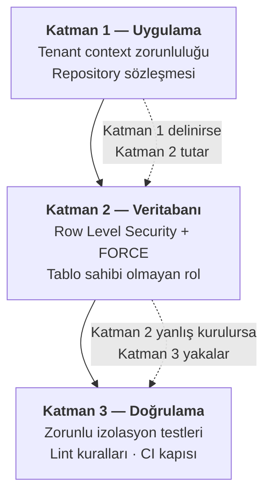
```mermaid
flowchart TD
    L1["<b>Katman 1 — Uygulama</b><br/>Tenant context zorunluluğu<br/>Repository sözleşmesi"]
    L2["<b>Katman 2 — Veritabanı</b><br/>Row Level Security + FORCE<br/>Tablo sahibi olmayan rol"]
    L3["<b>Katman 3 — Doğrulama</b><br/>Zorunlu izolasyon testleri<br/>Lint kuralları · CI kapısı"]

    L1 --> L2 --> L3
    L1 -. "Katman 1 delinirse<br/>Katman 2 tutar" .-> L2
    L2 -. "Katman 2 yanlış kurulursa<br/>Katman 3 yakalar" .-> L3
```

Katman 1 bir *disiplin*dir ve unutulabilir. Katman 2 bir *garanti*dir ve unutulamaz. Katman 3, Katman 2'nin doğru kurulduğunu kanıtlar.

### P4 — Tenant context transaction'a bağlıdır, bağlantıya değil

`SET LOCAL app.current_tenant_id` kullanılır; `SET` (LOCAL'sız) **yasaktır**. Connection pooling ile birleştiğinde `SET`, havuza dönen bağlantıda önceki tenant'ın kimliğini bırakır — bu, doğrudan tenant sızıntısıdır.

### P5 — Tenant sınırı ile yetki sınırı ayrı katmanlardır

| Soru | Cevaplayan |
|---|---|
| Bu veri hangi tenant'a ait? | **RLS** |
| Bu kullanıcı bu veriye ne yapabilir? | **RBAC** |

Biri diğerinin yerine geçmez, biri diğerini gereksiz kılmaz. RLS geçmiş bir sorgu hâlâ RBAC'e takılabilir; RBAC geçmiş bir işlem hâlâ RLS'e takılır.

### P6 — Tenant'a atfedilemeyen işlem yazılamaz

Her veri satırı, her dosya nesnesi, her cache anahtarı, her arama dokümanı, her AI çağrısının maliyeti bir tenant'a aittir. Sahipsiz kayıt üreten kod merge edilmez.

### P7 — Platform verisi ile tenant verisi ayrılır

`tenants` ve `users` tabloları tenant-scoped **değildir** — doğaları gereği tenant'ların üzerinde yaşarlar. Bu istisna açıkça listelenir, gerekçelendirilir ve telafi edici kontrolle korunur ([§12.4](#124-platform-tabloları--i̇stisna-listesi)). İstisna listesine ekleme yapmak mimari karar gerektirir.

### P8 — Basitlik, ayrılabilirlikten feragat etmeden

ARCHITECTURE.md'nin yön veren cümlesi burada da geçerlidir. V1 sade tutulur (Organization yok, hiyerarşi yok) ama gelecekteki katmanların **altına bozulmadan girebileceği** şekilde tasarlanır.

---

## 5. Domain Model

### 5.1 Kavramlar

| Kavram | Tanım | Modül |
|---|---|---|
| **Tenant** | İzolasyon, faturalama ve yönetim sınırı. Bir şirkete karşılık gelir. | Tenant |
| **User** | Sistemdeki bir insan. Tenant'lardan **bağımsız**, global bir kimlik. | Identity |
| **Membership** | Bir `User`'ın bir `Tenant` içindeki üyeliği. Rol ve durum burada yaşar. | Tenant ↔ Identity köprüsü |
| **TenantDomain** | Bir tenant'a ait doğrulanmış custom domain. | Tenant |
| **Invitation** | Bir kullanıcıyı tenant'a davet eden, süreli ve tek kullanımlık kayıt. | Tenant |
| **TenantContext** | Bir isteğin/işin çalıştığı tenant kimliği. Persist edilmez; runtime kavramıdır. | Platform |

### 5.2 İlişki diyagramı

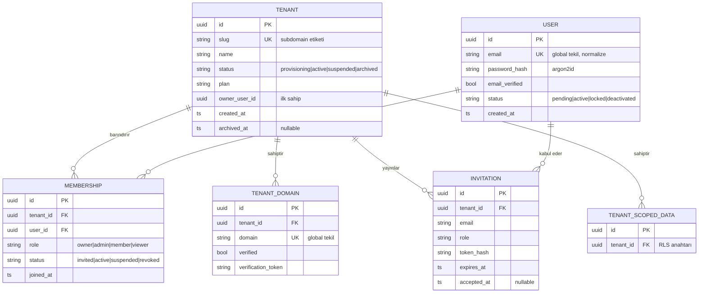
```mermaid
erDiagram
    TENANT ||--o{ MEMBERSHIP : "barındırır"
    USER   ||--o{ MEMBERSHIP : "sahiptir"
    TENANT ||--o{ TENANT_DOMAIN : "sahiptir"
    TENANT ||--o{ INVITATION : "yayınlar"
    USER   ||--o{ INVITATION : "kabul eder"
    TENANT ||--o{ TENANT_SCOPED_DATA : "sahiptir"

    TENANT {
        uuid   id PK
        string slug UK "subdomain etiketi"
        string name
        string status "provisioning|active|suspended|archived"
        string plan
        uuid   owner_user_id "ilk sahip"
        ts     created_at
        ts     archived_at "nullable"
    }

    USER {
        uuid   id PK
        string email UK "global tekil, normalize"
        string password_hash "argon2id"
        bool   email_verified
        string status "pending|active|locked|deactivated"
        ts     created_at
    }

    MEMBERSHIP {
        uuid   id PK
        uuid   tenant_id FK
        uuid   user_id FK
        string role "owner|admin|member|viewer"
        string status "invited|active|suspended|revoked"
        ts     joined_at
    }

    TENANT_DOMAIN {
        uuid   id PK
        uuid   tenant_id FK
        string domain UK "global tekil"
        bool   verified
        string verification_token
    }

    INVITATION {
        uuid   id PK
        uuid   tenant_id FK
        string email
        string role
        string token_hash
        ts     expires_at
        ts     accepted_at "nullable"
    }

    TENANT_SCOPED_DATA {
        uuid   id PK
        uuid   tenant_id FK "RLS anahtarı"
    }
```

### 5.3 Modeli belirleyen üç karar

#### One Company = One Tenant (ADR-0012)

Bir tenant, tam olarak **bir şirkete** karşılık gelir. Tenant aynı anda üç sınırın kesişimidir:

| Sınır | Anlamı |
|---|---|
| **İzolasyon sınırı** | Veri buradan dışarı çıkmaz |
| **Faturalama sınırı** | Plan, kota ve fatura buraya kesilir |
| **Yönetim sınırı** | Roller, davetler ve ayarlar burada tanımlanır |

Bu üçünün **aynı** sınır olması, modelin tüm sadeliğinin kaynağıdır. Ayrıştıkları an (örneğin "bir fatura, üç izolasyon alanı") hiyerarşi kaçınılmaz olur.

> **Dürüst dezavantaj:** Aynı şirketin iki departmanı veriyi ayırmak isterse V1'de tek çözüm iki ayrı tenant açmaktır — bu, iki ayrı fatura ve çapraz görünürlük olmaması demektir. Bu talep sıklaşırsa [§17.1](#171-organization-katmanı) gündeme gelir.

#### V1'de Organization entity yok (ADR-0013)

`Tenant` ile `User` arasında **hiçbir ara varlık yoktur**. Departman, ekip, bölüm, şube — hiçbiri V1'de modellenmez.

Sebep: Bir hiyerarşi katmanı eklendiği anda RLS politikaları hiyerarşik hâle gelir (`tenant_id IN (subtree)`), roller devralınabilir olur, raporlama çapraz-düğüm okumak zorunda kalır. Bu karmaşıklığın bedeli, henüz olmayan bir ihtiyaç için ödenmiş olur.

Karşılığında: `tenant_id` **tek ve düz** bir anahtardır. Her RLS politikası aynı tek satırlık şablonu kullanır ([§12.2](#122-politika-standardı)).

#### Global User + Membership (ADR-0014)

Kimlik globaldir, üyelik tenant-scoped'tur. Bu ayrım [§7](#7-user--membership-model)'de detaylandırılmıştır.

---

## 6. Tenant Model

### 6.1 Kimlik alanları

| Alan | Rol | Değişebilir mi | Kural |
|---|---|---|---|
| `id` (UUIDv7) | **Kalıcı teknik kimlik.** RLS anahtarı, tüm FK'ların hedefi, JWT claim'i. | ❌ Asla | Dışarıya sızabilir ama tek başına yetki vermez |
| `slug` | Subdomain etiketi (`acme` → `acme.businessos.app`). Routing ve branding. | ⚠️ Kontrollü | Global tekil, DNS-safe, rezerve liste dışı |
| `customDomain` | Tenant'ın kendi alan adı (`app.acme.com`). | ✅ Evet | Doğrulanmadan aktif olmaz ([§8.3](#83-custom-domain-doğrulaması)) |

> **Kritik ayrım:** `slug` ve `customDomain` **routing kimlikleridir**, güvenlik kimliği değil. Veri erişimi daima `id` üzerinden, daima JWT'den gelen değerle yapılır. `slug` değişse bile hiçbir veri satırı etkilenmez — çünkü hiçbir satır `slug`'a bağlı değildir.

**Rezerve slug'lar:** `www`, `api`, `app`, `admin`, `auth`, `docs`, `status`, `mail`, `static`, `cdn`, `assets`, `support`, `blog` ve tüm tek harfli etiketler. Bu liste kodda sabittir; runtime'da genişletilebilir ama daraltılamaz.

### 6.2 Yaşam döngüsü

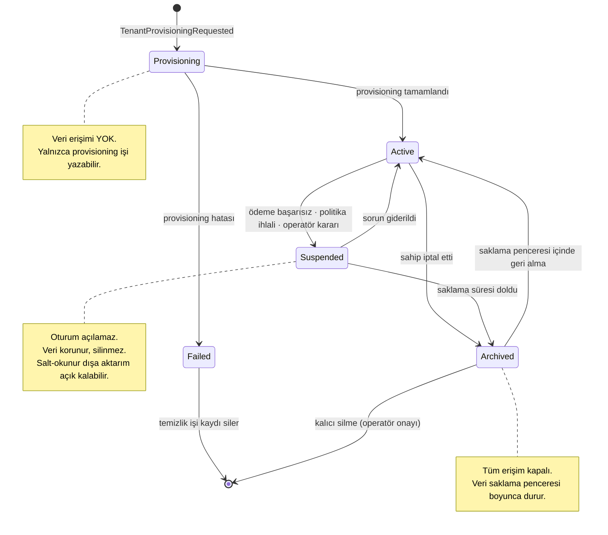
```mermaid
stateDiagram-v2
    [*] --> Provisioning : TenantProvisioningRequested

    Provisioning --> Active : provisioning tamamlandı
    Provisioning --> Failed  : provisioning hatası

    Failed --> [*] : temizlik işi kaydı siler

    Active --> Suspended : ödeme başarısız · politika ihlali · operatör kararı
    Suspended --> Active : sorun giderildi

    Active --> Archived    : sahip iptal etti
    Suspended --> Archived : saklama süresi doldu

    Archived --> Active : saklama penceresi içinde geri alma
    Archived --> [*]    : kalıcı silme (operatör onayı)

    note right of Provisioning
        Veri erişimi YOK.
        Yalnızca provisioning işi yazabilir.
    end note

    note right of Suspended
        Oturum açılamaz.
        Veri korunur, silinmez.
        Salt-okunur dışa aktarım açık kalabilir.
    end note

    note right of Archived
        Tüm erişim kapalı.
        Veri saklama penceresi boyunca durur.
    end note
```

### 6.3 Durumların erişim etkisi

| Durum | Login | Veri okuma | Veri yazma | Arka plan işleri |
|---|:---:|:---:|:---:|:---:|
| `provisioning` | ❌ | ❌ | ❌ (yalnız provisioning işi) | ❌ |
| `active` | ✅ | ✅ | ✅ | ✅ |
| `suspended` | ❌ | ⚠️ yalnız dışa aktarım | ❌ | ❌ |
| `archived` | ❌ | ❌ | ❌ | ❌ |

Durum kontrolü **tenant context kurulurken** yapılır ([§10](#10-request-lifecycle) adım 4). Her use case'in ayrıca kontrol etmesi gerekmez — bu, unutulabilecek bir disiplin olurdu.

### 6.4 Silme ve veri saklama

Tenant silme **iki aşamalıdır** ve ikinci aşama otomatik değildir:

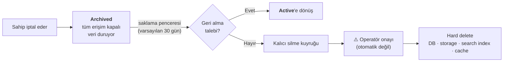
```mermaid
flowchart LR
    A["Sahip iptal eder"] --> B["<b>Archived</b><br/>tüm erişim kapalı<br/>veri duruyor"]
    B -->|"saklama penceresi<br/>(varsayılan 30 gün)"| C{"Geri alma<br/>talebi?"}
    C -->|Evet| D["<b>Active</b>'e dönüş"]
    C -->|Hayır| E["Kalıcı silme kuyruğu"]
    E --> F["⚠️ Operatör onayı<br/>(otomatik değil)"]
    F --> G["Hard delete<br/>DB · storage · search index · cache"]
```

**Kurallar**

- Kalıcı silme **asla** bir HTTP isteğiyle tetiklenmez. İdempotent, denetlenen, onaylı bir operatör işidir.
- Silme tüm veri yollarını kapsar: PostgreSQL satırları, storage nesneleri (`tenants/<tenantId>/…` prefix'i), arama index'i dokümanları, cache anahtarları (`t:<tenantId>:*` prefix'i).
- Audit kayıtları ve fatura kayıtları saklama yükümlülüğü gereği **silinmez**; anonimleştirilir.
- Silme işleminin kendisi bir audit kaydı üretir.

---

## 7. User & Membership Model

### 7.1 Neden global User (ADR-0014)

Kimlik **kişiye** aittir, şirkete değil. Bir danışman üç müşteri şirkette çalışıyorsa üç ayrı parola yönetmemelidir.

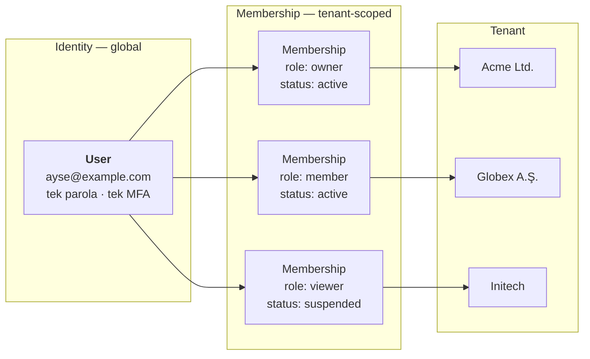
```mermaid
flowchart LR
    subgraph identity["Identity — global"]
        U["<b>User</b><br/>ayse@example.com<br/>tek parola · tek MFA"]
    end

    subgraph memberships["Membership — tenant-scoped"]
        M1["Membership<br/>role: owner<br/>status: active"]
        M2["Membership<br/>role: member<br/>status: active"]
        M3["Membership<br/>role: viewer<br/>status: suspended"]
    end

    subgraph tenants["Tenant"]
        T1["Acme Ltd."]
        T2["Globex A.Ş."]
        T3["Initech"]
    end

    U --> M1 --> T1
    U --> M2 --> T2
    U --> M3 --> T3
```

**Sözleşme**

| Katman | Kural |
|---|---|
| `User` | Global tekil `email`. Parola, MFA, e-posta doğrulaması burada. **Rol taşımaz.** |
| `Membership` | `(tenant_id, user_id)` üzerinde tekil. Rol ve üyelik durumu **yalnızca burada**. |

> **Neden `User` rol taşımaz:** Rol tenant'a görelidir. Aynı kişi bir tenant'ta `owner`, diğerinde `viewer` olabilir. Rolü `User`'a koymak, bu iki bağlamı birbirine karıştırır — ve karıştığı gün yetki yükseltmeye dönüşür.

### 7.2 Membership yaşam döngüsü

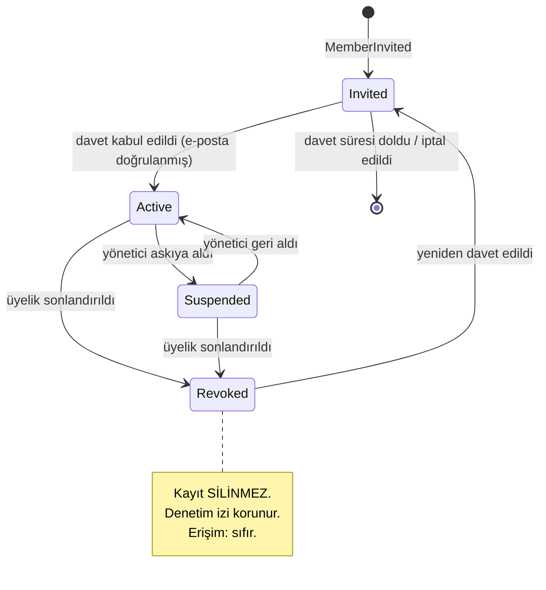
```mermaid
stateDiagram-v2
    [*] --> Invited : MemberInvited
    Invited --> Active : davet kabul edildi (e-posta doğrulanmış)
    Invited --> [*]    : davet süresi doldu / iptal edildi

    Active --> Suspended : yönetici askıya aldı
    Suspended --> Active : yönetici geri aldı

    Active --> Revoked    : üyelik sonlandırıldı
    Suspended --> Revoked : üyelik sonlandırıldı

    Revoked --> Invited : yeniden davet edildi

    note right of Revoked
        Kayıt SİLİNMEZ.
        Denetim izi korunur.
        Erişim: sıfır.
    end note
```

Yalnızca `active` üyelik erişim verir. `invited`, `suspended`, `revoked` durumlarının hepsi erişim açısından **eşdeğerdir: erişim yok**.

> **`revoked → invited`, `revoked → active` değil.** Üyeliği iptal edilmiş biri yeniden davet edildiğinde daveti **kabul etmek zorundadır**. Doğrudan aktifleştirmek, yöneticinin kullanıcının onayı olmadan ona erişim vermesi demektir — `DEVELOPMENT_RULES.md` §8'in "erişim açıkça verilir, varsayılan deny" ilkesiyle çelişir.
>
> Yeniden davette `joinedAt` **temizlenir**: kişi henüz yeniden katılmamıştır. Önceki katılma tarihi entity'nin değil, denetim kaydının sorumluluğundadır.

### 7.3 Global kimlik ile tenant izolasyonunun kesişimi

Global `User` tablosu, tasarımın en dikkat isteyen noktasıdır: kimlik globaldir ama **tenant'lar birbirinin kullanıcı listesini görmemelidir**.

| Risk | Önlem |
|---|---|
| Tenant A, `users` tablosunu okuyup tüm platformun kullanıcı listesini çıkarır | `users` doğrudan sorgulanmaz. Kullanıcı listeleme daima `memberships` üzerinden başlar (tenant-scoped, RLS korumalı) ve `users`'a yalnızca `JOIN` ile ulaşır. Bkz. [§12.4](#124-platform-tabloları--i̇stisna-listesi) |
| Davet akışı, bir e-postanın platformda kayıtlı olup olmadığını sızdırır | Davet yanıtı **daima aynıdır**: "davet gönderildi". Kullanıcının var olup olmadığı istemciye bildirilmez. |
| Login akışı, e-posta varlığını sızdırır | Hatalı kimlik bilgisi yanıtı e-posta ve parola için ayırt edilemez; yanıt süresi sabitlenir. |

### 7.4 Tenant değiştirme (switching)

**Bir token, bir tenant.** Bir access token tam olarak tek bir `tenant_id` claim'i taşır. Tenant değiştirmek, yeni bir token almaktır.

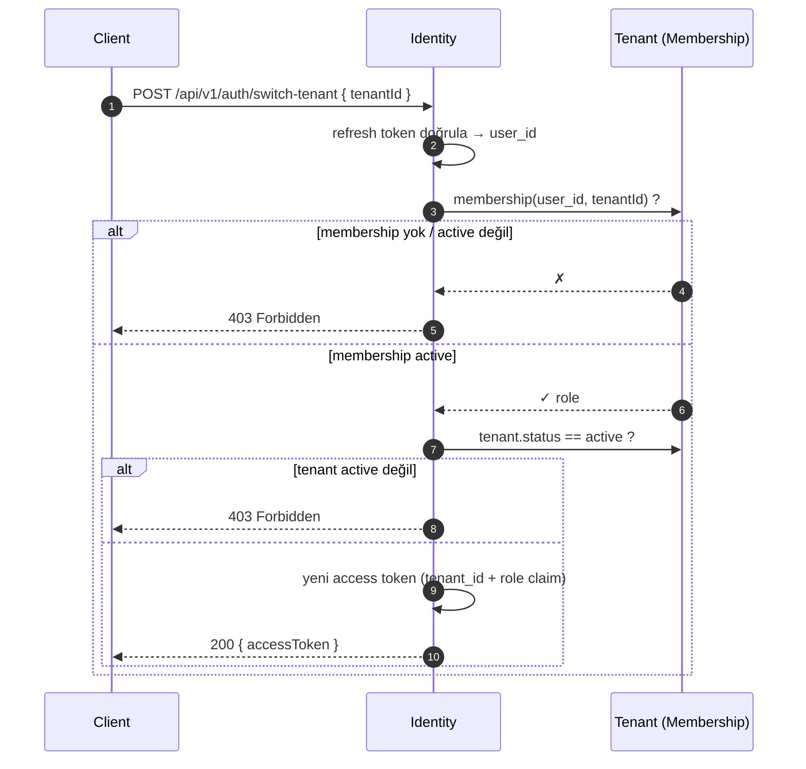
```mermaid
sequenceDiagram
    autonumber
    participant C as Client
    participant I as Identity
    participant T as Tenant (Membership)

    C->>I: POST /api/v1/auth/switch-tenant { tenantId }
    I->>I: refresh token doğrula → user_id
    I->>T: membership(user_id, tenantId) ?
    alt membership yok / active değil
        T-->>I: ✗
        I-->>C: 403 Forbidden
    else membership active
        T-->>I: ✓ role
        I->>T: tenant.status == active ?
        alt tenant active değil
            I-->>C: 403 Forbidden
        else
            I->>I: yeni access token (tenant_id + role claim)
            I-->>C: 200 { accessToken }
        end
    end
```

**Kritik kural:** Tenant değişimi **sunucuda** üyelik doğrulamasından geçer. İstemcinin gönderdiği `tenantId` bir *talep*tir, karar değil. Yeni token yalnızca doğrulama başarılıysa üretilir.

Eşzamanlı çok-tenant oturum ([N7](#non-goals-v1de-bilinçli-olarak-yapılmıyor)) desteklenmez: iki tenant'ta aynı anda "aktif" olmak, `AsyncLocalStorage` context'inin hangi tenant'a ait olduğunu belirsizleştirir ve sızıntının en kolay yolunu açar.

### 7.5 Role modeli — bugün enum, yarın tablo

Rol `Membership` üzerinde yaşar ([§7.1](#71-neden-global-user-adr-0014)). V1'de rol kümesi sabittir: `owner` · `admin` · `member` · `viewer`.

Ancak **rol persistence'ta enum, domain'de value object'tir**:

| Katman | Temsil |
|---|---|
| Domain / Application | `Role` **value object** |
| Persistence | `string` / `enum` kolon |
| Gelecek | `roles` tablosuna minimum kırılımla geçiş |

**Neden VO:** `ARCHITECTURE.md` §10.1'in nihai vizyonu tenant-scoped, veri-tabanlı rollerdir — her tenant kendi rollerini tanımlar. V1'de bu karmaşıklığı üstlenmiyoruz ([ADR-0013](../adr/0013-organization-strategy.md) ile aynı "gereksiz karmaşıklığı erteleme" ilkesi). Rolü en baştan VO olarak modellemek, ileride `enum → roles` tablosu FK geçişini **business logic'e dokunmadan** yapılabilir kılar; yalnızca persistence adapter'ı değişir.

Bu aynı zamanda `DEVELOPMENT_RULES.md` §2.4'ün primitive obsession yasağının doğrudan uygulanmasıdır: rol bir kimliktir, `string` değil.

> **`owner` sistem rolüdür** ve bu, VO seviyesinde korunan bir **invariant**'tır: değiştirilemez, silinemez. Yalnızca bir DB kısıtı değildir — kısıt veri bütünlüğünü korur, VO ise **iş kuralını** korur ve kural veritabanına ulaşmadan önce uygulanır.

Rolün nasıl değerlendirileceği (permission çözümü, policy engine) bu dokümanın kapsamı dışındadır — bkz. `ARCHITECTURE.md` §10.1 ve Faz 3 Authorization dokümanı. Burada tanımlanan yalnızca rolün **nerede yaşadığı** ve **nasıl temsil edildiğidir**.

Karar kaydı: [ADR-0014](../adr/0014-global-user-membership.md).

---

## 8. Tenant Resolution Strategy

**ADR-0015 — Hybrid Tenant Resolution.**

### 8.1 İki soruyu karıştırmamak

Tenant resolution, birbirine benzeyen ama **tamamen farklı** iki sorunun cevabıdır:

| # | Soru | Kaynak | Güven seviyesi |
|---|---|---|---|
| 1 | Bu istek hangi tenant'ın *arayüzüne* geldi? | `Host` başlığı (custom domain / subdomain) | ⚠️ **Güvenilmez** — istemci kontrolünde |
| 2 | Bu istek hangi tenant'ın *verisine* erişebilir? | Doğrulanmış JWT claim + membership | ✅ **Güvenlik sınırı** |

Soru 1'in cevabı branding ve routing içindir. **Tek başına hiçbir veri açmaz.** Soru 2'nin cevabı tek yetki kaynağıdır.

### 8.2 Çözüm zinciri

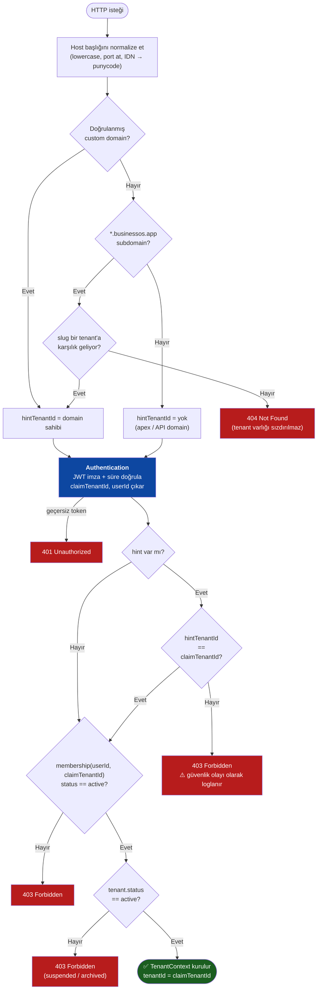
```mermaid
flowchart TD
    START(["HTTP isteği"]) --> H["Host başlığını normalize et<br/>(lowercase, port at, IDN → punycode)"]

    H --> CD{"Doğrulanmış<br/>custom domain?"}
    CD -->|Evet| HINT["hintTenantId = domain sahibi"]
    CD -->|Hayır| SUB{"*.businessos.app<br/>subdomain?"}

    SUB -->|Evet| SLUG{"slug bir tenant'a<br/>karşılık geliyor?"}
    SUB -->|Hayır| NOHINT["hintTenantId = yok<br/>(apex / API domain)"]

    SLUG -->|Evet| HINT
    SLUG -->|Hayır| R404["404 Not Found<br/>(tenant varlığı sızdırılmaz)"]

    HINT --> AUTH
    NOHINT --> AUTH

    AUTH["<b>Authentication</b><br/>JWT imza + süre doğrula<br/>claimTenantId, userId çıkar"]
    AUTH -->|geçersiz token| R401["401 Unauthorized"]

    AUTH --> XCHECK{"hint var mı?"}
    XCHECK -->|Hayır| MEM
    XCHECK -->|Evet| MATCH{"hintTenantId<br/>==<br/>claimTenantId?"}
    MATCH -->|Hayır| R403A["403 Forbidden<br/>⚠️ güvenlik olayı olarak loglanır"]
    MATCH -->|Evet| MEM

    MEM{"membership(userId, claimTenantId)<br/>status == active?"}
    MEM -->|Hayır| R403B["403 Forbidden"]
    MEM -->|Evet| TST{"tenant.status<br/>== active?"}

    TST -->|Hayır| R403C["403 Forbidden<br/>(suspended / archived)"]
    TST -->|Evet| OK(["✅ TenantContext kurulur<br/>tenantId = claimTenantId"])

    style OK fill:#1b5e20,color:#fff
    style AUTH fill:#0d47a1,color:#fff
    style R401 fill:#b71c1c,color:#fff
    style R403A fill:#b71c1c,color:#fff
    style R403B fill:#b71c1c,color:#fff
    style R403C fill:#b71c1c,color:#fff
    style R404 fill:#b71c1c,color:#fff
```

### 8.3 Custom domain doğrulaması

Bir custom domain, sahipliği kanıtlanmadan **asla** aktif olmaz. Kanıtsız kabul, bir tenant'ın başka bir tenant'ın alan adını kendine bağlaması demektir.

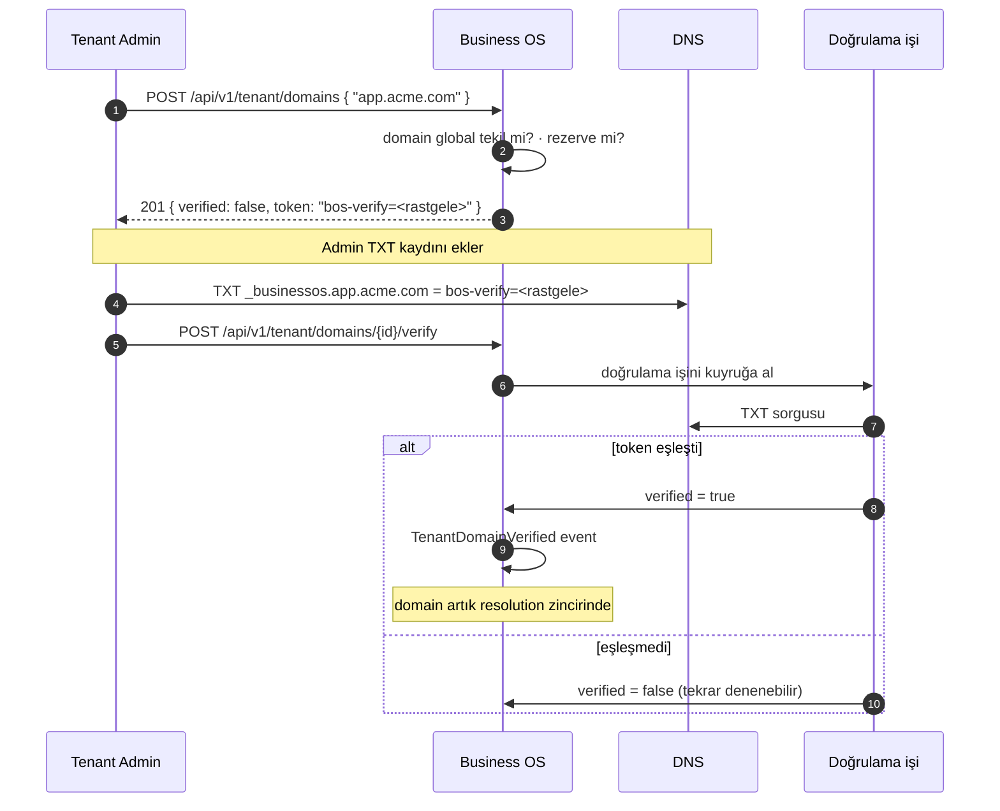
```mermaid
sequenceDiagram
    autonumber
    participant A as Tenant Admin
    participant S as Business OS
    participant D as DNS
    participant W as Doğrulama işi

    A->>S: POST /api/v1/tenant/domains { "app.acme.com" }
    S->>S: domain global tekil mi? · rezerve mi?
    S-->>A: 201 { verified: false, token: "bos-verify=<rastgele>" }
    Note over A,D: Admin TXT kaydını ekler
    A->>D: TXT _businessos.app.acme.com = bos-verify=<rastgele>
    A->>S: POST /api/v1/tenant/domains/{id}/verify
    S->>W: doğrulama işini kuyruğa al
    W->>D: TXT sorgusu
    alt token eşleşti
        W->>S: verified = true
        S->>S: TenantDomainVerified event
        Note over S: domain artık resolution zincirinde
    else eşleşmedi
        W->>S: verified = false (tekrar denenebilir)
    end
```

**Kurallar**

- `domain` alanı **global tekil**dir. İki tenant aynı domain'i talep edemez.
- Doğrulanmamış domain resolution zincirine **girmez** — o Host'a gelen istek 404 alır.
- Doğrulama periyodik olarak **yeniden kontrol edilir**. DNS kaydı kaldırılan domain devre dışı bırakılır (dangling domain devralma önlemi).
- TLS sertifikası doğrulamadan sonra sağlanır.

### 8.4 Neden bu zincir — ve dürüst bedeli

| Avantaj | |
|---|---|
| Güvenlik sınırı tek yerde | Yalnızca JWT. Host manipülasyonu hiçbir kapı açmaz. |
| Enterprise beklentisi karşılanır | Custom domain kurumsal satışta sık bir taleptir. |
| Yanlış-tenant hataları erken yakalanır | Host ↔ claim uyuşmazlığı 403 üretir ve loglanır — token çalınmasının erken sinyali olabilir. |
| Domain'siz istemciler desteklenir | Mobil/API istemcisi apex domain'den gelir; hint yoktur, JWT tek başına yeter. |

| Dezavantaj / bedel | |
|---|---|
| Operasyonel yük | Wildcard DNS + wildcard TLS + custom domain başına sertifika sağlama. |
| Cache anahtarları Host'a duyarlı | CDN/edge cache tenant'lar arası karışabilir; `Vary: Host` ve tenant'lı cache anahtarı zorunlu. |
| Çapraz kontrol yanlış pozitif üretebilir | Kullanıcı tenant değiştirip eski sekmede işlem yaparsa 403 alır. UX'te "oturumunuz başka bir tenant'a geçti" olarak ele alınmalıdır. |

---

## 9. Tenant Provisioning Flow

**ADR-0016 — E-posta doğrulaması, tenant provisioning'den önce gelir.**

### 9.1 Neden önce doğrulama

Doğrulanmamış bir e-posta ile tenant açılırsa:

| Risk | Sonuç |
|---|---|
| Bot kaydı | Çöp tenant'lar, tüketilmiş slug'lar, şişmiş veritabanı |
| Başkasının e-postasıyla kayıt | Gerçek sahip sisteme girdiğinde e-postası "alınmış" olur |
| Slug squatting | Değerli slug'lar sahte kayıtlarla rezerve edilir |
| Sahipsiz tenant | `owner` rolü, erişilemeyen bir e-postaya bağlı kalır — kurtarma yolu yok |

Bunların hepsi *sonradan temizlenebilir* görünür. Değildir: tenant açıldığı anda veri, davet ve fatura kaydı doğurur.

> **Kural:** `Tenant` kaydı, `User.emailVerified == true` olmadan **oluşturulmaz**. Doğrulama öncesi var olan tek kayıt `User`'dır ve o kullanıcının hiçbir tenant'a erişimi yoktur.

### 9.2 Akış

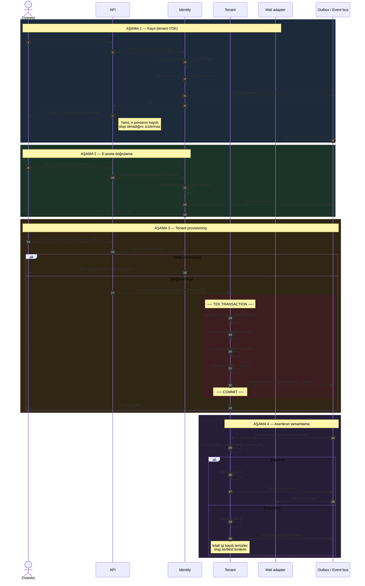
```mermaid
sequenceDiagram
    autonumber
    actor V as Ziyaretçi
    participant API as API
    participant ID as Identity
    participant TN as Tenant
    participant MAIL as Mail adapter
    participant OB as Outbox / Event bus

    rect rgb(28,42,58)
    Note over V,MAIL: AŞAMA 1 — Kayıt (tenant YOK)
    V->>API: POST /api/v1/auth/register { email, password }
    API->>ID: createUser(email, password)
    ID->>ID: e-posta normalize · Argon2id hash
    ID->>ID: status=pending · emailVerified=false
    ID->>OB: UserRegistered (aynı transaction)
    ID-->>API: 201
    API-->>V: 201 "Doğrulama e-postası gönderildi"
    Note right of API: Yanıt, e-postanın kayıtlı<br/>olup olmadığını sızdırmaz
    OB->>MAIL: doğrulama bağlantısı gönder
    end

    rect rgb(28,52,40)
    Note over V,ID: AŞAMA 2 — E-posta doğrulama
    V->>API: GET /api/v1/auth/verify?token=...
    API->>ID: token doğrula (tek kullanımlık · süreli)
    ID->>ID: emailVerified=true · status=active
    ID->>OB: UserEmailVerified
    ID-->>V: 200 → tenant oluşturma ekranı
    end

    rect rgb(48,38,20)
    Note over V,OB: AŞAMA 3 — Tenant provisioning
    V->>API: POST /api/v1/tenants { name, slug }
    API->>ID: emailVerified kontrolü
    alt doğrulanmamış
        ID-->>V: 403 "Önce e-postanızı doğrulayın"
    else doğrulanmış
        API->>TN: provisionTenant(name, slug, ownerUserId)

        rect rgb(60,30,30)
        Note over TN: ── TEK TRANSACTION ──
        TN->>TN: slug tekil · rezerve değil (DB kısıtı)
        TN->>TN: Tenant(status=provisioning)
        TN->>TN: Membership(owner, active)
        TN->>TN: varsayılan roller · ayarlar
        TN->>OB: TenantProvisioningRequested → outbox
        Note over TN: ── COMMIT ──
        end

        TN-->>V: 202 Accepted
    end
    end

    rect rgb(38,30,55)
    Note over TN,OB: AŞAMA 4 — Asenkron tamamlama
    OB->>TN: provisioning handler (idempotent)
    TN->>TN: storage prefix · search index · örnek veri
    alt başarılı
        TN->>TN: status = active
        TN->>OB: TenantProvisioned
        OB->>MAIL: "Tenant'ınız hazır"
    else başarısız
        TN->>TN: status = failed
        TN->>OB: TenantProvisioningFailed
        Note over TN: telafi işi kaydı temizler,<br/>slug serbest bırakılır
    end
    end
```

### 9.3 Transaction sınırları

| Adım | Sınır | Gerekçe |
|---|---|---|
| Tenant + owner Membership + outbox kaydı | **Tek transaction** | Sahipsiz tenant asla var olamaz. Bu atomiklik pazarlık konusu değildir. |
| Storage/search/örnek veri hazırlığı | Ayrı, asenkron, idempotent | Dış sistem çağrısı DB transaction'ını uzatamaz. |
| Slug tekilliği | **Veritabanı unique index** | Uygulama seviyesinde "önce kontrol et sonra yaz" bir yarış koşuludur. Kısıt ihlali yakalanıp 409'a çevrilir. |
| Slug nezaket kontrolü (`existsBySlug`) | **Aynı transaction'ın içinde** | Repository çağrıları aktif transaction gerektirir ([§11.4](#114-zorunlu-kurallar) kural 2). Ayrıntı: [§12.4.1](#1241-tenant-resolution-i̇çin-kontrollü-rls-aşımı) |

> **Nezaket kontrolü neden transaction'ın içinde.** İlk implementasyonda kontrol transaction'dan **önce** yapılıyordu; bu, [§11.4](#114-zorunlu-kurallar) kural 2 ile çelişti: `SET LOCAL`'sız bir bağlantıda çalışan sorgu ya RLS'e takılır ya da filtresiz çalışır, ve ikincisi tüm veritabanını açar. Bu yüzden repository havuza düşmez, **hata fırlatır**.
>
> Kontrolü transaction'ın içine almak ek bir maliyet getirmez: `resolve_tenant` `SECURITY DEFINER` olduğu için tenant context'i altında da çalışır ve ikinci bir transaction gerekmez.
>
> Kontrolün transaction içinde olması onu bir **garanti** hâline **getirmez** — iki eşzamanlı istek onu hâlâ birlikte geçebilir. Tekilliğin tek gerçek kaynağı unique index'tir.

### 9.4 Idempotency

Provisioning handler **at-least-once** çalışacak varsayımıyla yazılır. Aynı `TenantProvisioningRequested` iki kez işlenirse ikinci çalıştırma hiçbir yan etki üretmemelidir. Handler her adımda "zaten yapılmış mı" kontrolü yapar; `status` alanı ilerlemeyi taşır.

---

## 10. Request Lifecycle

Sıra **sabittir**. Adım atlanamaz, sıra değiştirilemez. Bu bölüm, "tenant kontrolünü şuraya alsak" tartışmasını kapatmak için vardır.

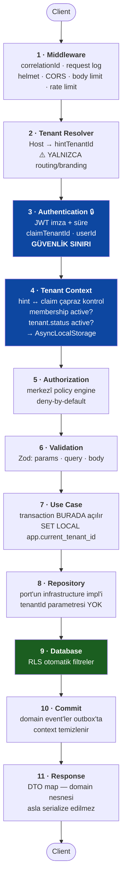
```mermaid
flowchart TD
    C(["Client"]) --> M

    M["<b>1 · Middleware</b><br/>correlationId · request log<br/>helmet · CORS · body limit · rate limit"]
    M --> TR

    TR["<b>2 · Tenant Resolver</b><br/>Host → hintTenantId<br/>⚠️ YALNIZCA routing/branding"]
    TR --> AU

    AU["<b>3 · Authentication</b> 🔒<br/>JWT imza + süre<br/>claimTenantId · userId<br/><b>GÜVENLİK SINIRI</b>"]
    AU --> TC

    TC["<b>4 · Tenant Context</b><br/>hint ↔ claim çapraz kontrol<br/>membership active?<br/>tenant.status active?<br/>→ AsyncLocalStorage"]
    TC --> AZ

    AZ["<b>5 · Authorization</b><br/>merkezî policy engine<br/>deny-by-default"]
    AZ --> VA

    VA["<b>6 · Validation</b><br/>Zod: params · query · body"]
    VA --> UC

    UC["<b>7 · Use Case</b><br/>transaction BURADA açılır<br/>SET LOCAL app.current_tenant_id"]
    UC --> RE

    RE["<b>8 · Repository</b><br/>port'un infrastructure impl'i<br/>tenantId parametresi YOK"]
    RE --> DB

    DB["<b>9 · Database</b><br/>RLS otomatik filtreler"]
    DB --> CM

    CM["<b>10 · Commit</b><br/>domain event'ler outbox'ta<br/>context temizlenir"]
    CM --> RS

    RS["<b>11 · Response</b><br/>DTO map — domain nesnesi<br/>asla serialize edilmez"]
    RS --> OUT(["Client"])

    style AU fill:#0d47a1,color:#fff
    style TC fill:#0d47a1,color:#fff
    style DB fill:#1b5e20,color:#fff
```

### 10.1 Adım kuralları

| Adım | Kritik kural |
|---|---|
| 2 · Tenant Resolver | Host **yetki kaynağı değildir**. Tek başına hiçbir veri erişimi açamaz. |
| 3 · Authentication | `tenant_id`'nin tek meşru kaynağı doğrulanmış JWT claim'idir. Header/body/query'den **asla** alınmaz. |
| 4 · Tenant Context | Üç kontrol de burada: çapraz kontrol, membership, tenant durumu. Use case'lerin tekrar kontrol etmesi beklenmez. |
| 5 · Authorization | Controller'da dağınık `if` yasak. Karar merkezî policy engine'de. |
| 6 · Validation | Doğrulama **yetkilendirmeden sonra** çalışır: yetkisiz kullanıcıya şema detayı sızdırılmaz. |
| 7 · Use Case | Transaction sınırı burasıdır. Repository kendi başına transaction açmaz. |
| 8 · Repository | Metot imzasında `tenantId` **bulunmaz**. Context'ten gelir. Bkz. [§13](#13-repository-design) |
| 11 · Response | Domain nesnesi serialize edilmez — sızıntı yüzeyi budur. |

### 10.2 HTTP dışı giriş noktaları

Cron, queue ve outbox işlerinde HTTP katmanı yoktur. Tenant context **açıkça** kurulur; güvence HTTP yolundakiyle **aynıdır**.

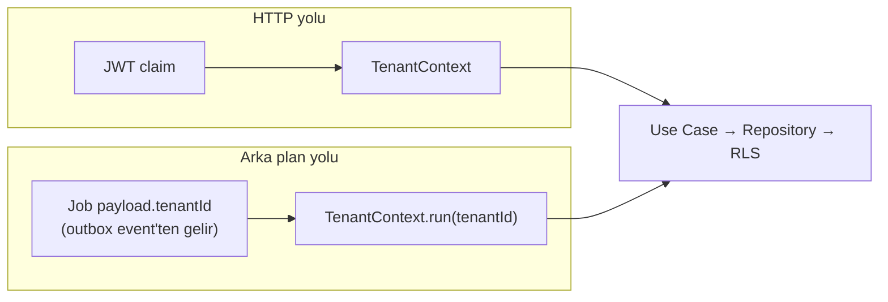
```mermaid
flowchart LR
    subgraph http["HTTP yolu"]
        H1["JWT claim"] --> H2["TenantContext"]
    end
    subgraph job["Arka plan yolu"]
        J1["Job payload.tenantId<br/>(outbox event'ten gelir)"] --> J2["TenantContext.run(tenantId)"]
    end
    H2 --> UC["Use Case → Repository → RLS"]
    J2 --> UC
```

**Kurallar**

- Tenant context'i kurulmamış bir job tenant verisine **erişemez** — boş sonuç değil, hata alır.
- Çok-tenant'lı toplu iş (örneğin gecelik rapor), tenant listesini alıp **her tenant için ayrı context** açar. Tek context içinde birden fazla tenant işlenmesi yasaktır.
- `tenantId` payload'dan gelir ama **kaynağı** güvenilirdir: outbox event'i, ilk üreten transaction'da yazılmıştır.

---

## 11. AsyncLocalStorage Context Flow

### 11.1 Neden AsyncLocalStorage

Tenant kimliğini her fonksiyona parametre olarak taşımak teoride en açık yoldur; pratikte **unutulur**. Node.js'te `AsyncLocalStorage`, bir async çağrı ağacının tamamına görünmez ama güvenilir bir bağlam taşır.

| Alternatif | Neden seçilmedi |
|---|---|
| Her metoda `tenantId` parametresi | 40 katman derinlikte bir çağrı zincirinde bir yerde unutulur; unutulduğu yer sızıntıdır |
| NestJS `REQUEST` scoped provider | Her istekte DI ağacını yeniden kurar (performans); HTTP dışı işlerde (cron/queue) çalışmaz |
| Global değişken | Eşzamanlı isteklerde tenant'lar birbirine karışır — kabul edilemez |

### 11.2 Context içeriği

`TenantContext` **immutable**'dır. Bir kez kurulur, istek boyunca değişmez.

| Alan | Açıklama |
|---|---|
| `tenantId` | Doğrulanmış JWT claim'inden. RLS anahtarı. |
| `userId` | Eylemi yapan kullanıcı. |
| `role` | Kullanıcının bu tenant'taki rolü (membership'ten). |
| `correlationId` | İstek/iş izleme kimliği. |
| `source` | `http` · `job` · `outbox` — denetim ve hata ayıklama için. |

> Context **salt-okunurdur**. Middleware'den sonra hiçbir katman `tenantId` değiştiremez. "Bu use case için tenant'ı değiştir" ihtiyacı doğuyorsa tasarım yanlıştır — o iş ayrı bir context ile çalıştırılır.

### 11.3 Akış

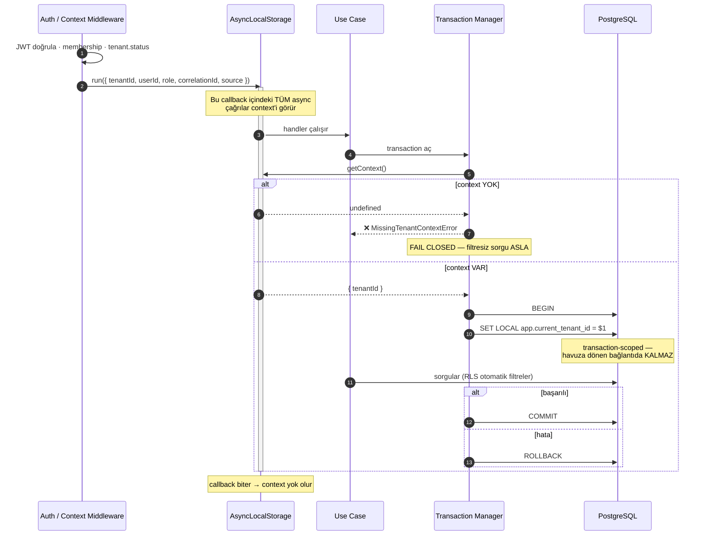
```mermaid
sequenceDiagram
    autonumber
    participant MW as Auth / Context Middleware
    participant ALS as AsyncLocalStorage
    participant UC as Use Case
    participant TX as Transaction Manager
    participant PG as PostgreSQL

    MW->>MW: JWT doğrula · membership · tenant.status
    MW->>ALS: run({ tenantId, userId, role, correlationId, source })
    activate ALS
    Note over ALS: Bu callback içindeki TÜM async<br/>çağrılar context'i görür

    ALS->>UC: handler çalışır
    UC->>TX: transaction aç
    TX->>ALS: getContext()
    alt context YOK
        ALS-->>TX: undefined
        TX-->>UC: ❌ MissingTenantContextError
        Note over TX: FAIL CLOSED — filtresiz sorgu ASLA
    else context VAR
        ALS-->>TX: { tenantId }
        TX->>PG: BEGIN
        TX->>PG: SET LOCAL app.current_tenant_id = $1
        Note over PG: transaction-scoped —<br/>havuza dönen bağlantıda KALMAZ
        UC->>PG: sorgular (RLS otomatik filtreler)
        alt başarılı
            TX->>PG: COMMIT
        else hata
            TX->>PG: ROLLBACK
        end
    end
    deactivate ALS
    Note over ALS: callback biter → context yok olur
```

### 11.4 Zorunlu kurallar

| # | Kural | İhlalin sonucu |
|---|---|---|
| 1 | `SET LOCAL` kullanılır, `SET` **yasaktır** | Bağlantı havuza döner, sonraki tenant önceki tenant'ın kimliğiyle sorgu çalıştırır → doğrudan sızıntı |
| 2 | Context olmadan bağlantı alınamaz | Filtresiz sorgu → tüm veritabanı açılır |
| 3 | Context yoksa **hata** fırlatılır, boş sonuç dönülmez | Sessiz boş sonuç, hatayı üretimde aylarca gizler |
| 4 | Tek transaction içinde tek tenant | Çapraz-tenant yazma |
| 5 | `tenantId` context'e yazıldıktan sonra değiştirilemez | Yetki yükseltme |
| 6 | Havuzdan alınan her bağlantı `SET LOCAL` almadan sorgu çalıştıramaz | RLS `current_setting` bulunamayınca ya hata verir ya boş döner — ikisi de üretimde sürpriz |

> **Bilinen tuzak:** Manuel `pool.connect()` ile alınan ve transaction açmadan kullanılan bağlantı, `SET LOCAL`'ın kapsamı dışında kalır. Bu yüzden bağlantı erişimi **yalnızca** transaction manager üzerinden yapılır; ham havuz erişimi lint kuralıyla engellenir.

---

## 12. PostgreSQL Row Level Security Strategy

RLS bu mimarinin **son savunma hattıdır**. Uygulama katmanındaki her disiplin unutulabilir; RLS unutulamaz — çünkü sorguyu veritabanı filtreler.

### 12.1 Rol modeli — en kritik ayrıntı

> ⚠️ **Tablo sahibi rol, RLS politikalarını atlar.** Uygulama tablo sahibi bir rolle bağlanırsa RLS **hiçbir şey yapmaz** ve bu, testler yeşilken sessizce yanlış olan bir durumdur.

Sistemde **iki** uygulama rolü vardır (`docker/postgres/init/01-roles.sql`). Migration işini ayrı bir rol değil, `businessos_owner` yapar.

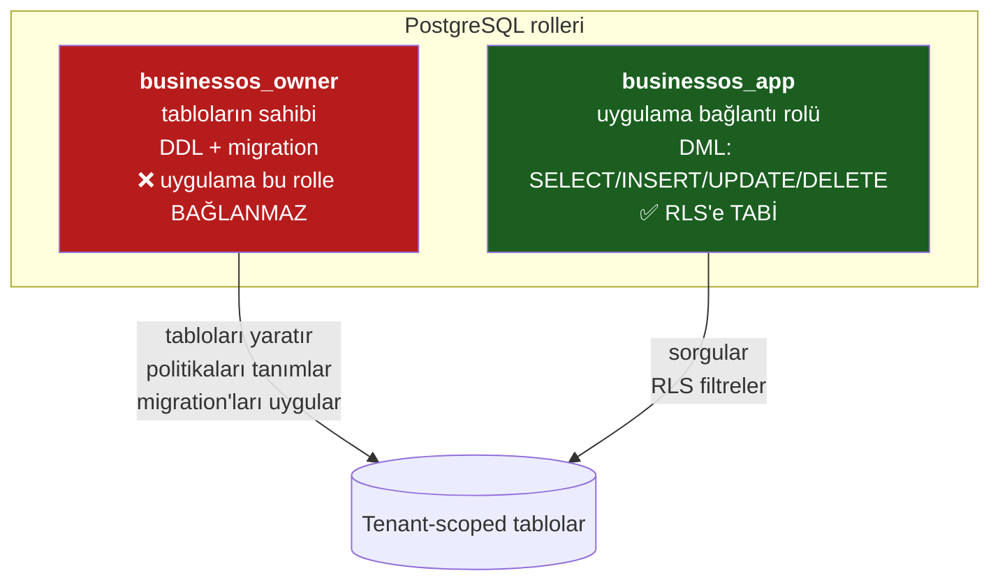
```mermaid
flowchart TD
    subgraph roles["PostgreSQL rolleri"]
        OWNER["<b>businessos_owner</b><br/>tabloların sahibi<br/>DDL + migration<br/>❌ uygulama bu rolle BAĞLANMAZ"]
        APP["<b>businessos_app</b><br/>uygulama bağlantı rolü<br/>DML: SELECT/INSERT/UPDATE/DELETE<br/>✅ RLS'e TABİ"]
    end

    OWNER -->|"tabloları yaratır<br/>politikaları tanımlar<br/>migration'ları uygular"| T[("Tenant-scoped tablolar")]
    APP -->|"sorgular<br/>RLS filtreler"| T

    style APP fill:#1b5e20,color:#fff
    style OWNER fill:#b71c1c,color:#fff
```

Bağlantı dizeleri de bu ayrımı yansıtır: uygulama runtime'ı `DATABASE_URL` (→ `businessos_app`), migration hattı `DATABASE_MIGRATION_URL` (→ `businessos_owner`) kullanır. Uygulama, migration bağlantı dizesini **asla görmez**.

| Kural | |
|---|---|
| Uygulama **asla** tablo sahibi rolle bağlanmaz | `businessos_app` ≠ `businessos_owner` |
| Her iki rol de `BYPASSRLS` yetkisi **taşımaz** | İkisi de `NOBYPASSRLS` ile yaratılır |
| `businessos_app` süper kullanıcı **değildir** | Süper kullanıcı RLS'i atlar |
| Bu ayrım **test edilir** | Bir entegrasyon testi, uygulama rolünün RLS'e tabi olduğunu doğrular |

> **`NOBYPASSRLS` yeterli değildir — nüans önemli.** `businessos_owner` da `NOBYPASSRLS` ile yaratılmıştır, ama bu onu RLS'e tabi kılmaz: sahip rol politikaları **`BYPASSRLS` yetkisiyle değil, tablo sahipliğiyle** atlar. `FORCE ROW LEVEL SECURITY` tam olarak bu boşluğu kapatmak için vardır ([§12.2](#122-politika-standardı)).
>
> Yani izolasyon iki bağımsız önleme dayanır: **(1)** uygulamanın sahip olmayan bir rolle bağlanması, **(2)** politikaların `FORCE` edilmiş olması. Biri unutulursa diğeri tutar; ikisi birden gerekir.

### 12.2 Politika standardı

Tenant verisi tutan **her** tablo bu şablona uyar. Sapma yoktur.

```sql
-- Her tenant-scoped tablo için, istisnasız:
ALTER TABLE <schema>.<table> ENABLE ROW LEVEL SECURITY;
ALTER TABLE <schema>.<table> FORCE  ROW LEVEL SECURITY;

CREATE POLICY tenant_isolation ON <schema>.<table>
  USING      (tenant_id = current_setting('app.current_tenant_id')::uuid)
  WITH CHECK (tenant_id = current_setting('app.current_tenant_id')::uuid);
```

| Parça | Neden zorunlu |
|---|---|
| `ENABLE` | Politikayı devreye alır |
| `FORCE` | **Tablo sahibi için de** uygular. Olmadan sahip rol politikayı atlar. |
| `USING` | **Okumayı** korur — `SELECT`, `UPDATE`/`DELETE`'in hedef satır seçimi |
| `WITH CHECK` | **Yazmayı** korur — `INSERT` ve `UPDATE` sonrası satırın hâlâ tenant'a ait olmasını zorlar |

> `WITH CHECK` olmadan bir kullanıcı, kendi tenant'ındaki satırın `tenant_id`'sini başka bir tenant'a **taşıyabilir**. Bu, sızıntının tersidir ama aynı derecede yıkıcıdır. İkisi de zorunludur.

### 12.3 Tablo sözleşmesi

Her tenant-scoped tablo:

| Gereklilik | Detay |
|---|---|
| `tenant_id uuid NOT NULL` | Nullable olamaz — `NULL` politikayı belirsizleştirir |
| `REFERENCES platform.tenants(id)` | Referans bütünlüğü. **Not:** bu, modüller arası değil, modül→platform yönlü tek istisnadır |
| Index: `(tenant_id, …)` | Her sorgu `tenant_id` ile filtrelenir; bileşik index'lerde **daima ilk kolon** |
| Unique kısıtlar tenant-scoped | `UNIQUE(name)` değil, `UNIQUE(tenant_id, name)`. Aksi hâlde bir tenant'ın kaydı diğerinin yazmasını engeller (ve varlığını sızdırır) |
| İzolasyon testi | Tenant A ↔ B okuma/yazma testi olmadan tablo merge edilmez |

### 12.4 Platform tabloları — istisna listesi

Bazı tablolar doğaları gereği tenant-scoped değildir. Bu liste **kapalıdır**; ekleme yapmak mimari karar gerektirir.

| Tablo | Neden tenant-scoped değil | Telafi edici kontrol |
|---|---|---|
| `platform.tenants` | Tenant'ın kendisi | Yalnızca kendi tenant satırını gösteren RLS politikası (`id = current_setting(...)`); listeleme endpoint'i yok. **`FORCE` yoktur** — gerekçe [§12.4.1](#1241-tenant-resolution-i̇çin-kontrollü-rls-aşımı) |
| `platform.users` | Kimlik globaldir | **Doğrudan sorgulanmaz.** Erişim daima `memberships` (RLS korumalı) üzerinden `JOIN` ile. Repository seviyesinde zorlanır |
| `platform.memberships` | Tenant ↔ user köprüsü | `tenant_id` taşır → **standart RLS uygulanır** |
| `platform.tenant_domains` | Resolution, auth'tan önce çalışır | Yalnızca `domain → tenant_id` çözümü için okunur; başka alan dönmez |
| `platform.outbox` | Publisher tenant'lar arası okur | `tenant_id` taşır → **standart RLS uygulanır** (`ENABLE` + `FORCE`). Yazma tarafı tenant context'i altında çalışır. Okuma tarafı için bkz. [§12.4.2](#1242-outbox-publisher-i̇çin-planlanan-aşım) |
| `platform.audit_log` | Değişmez denetim kaydı | `tenant_id` taşır → **standart RLS uygulanır**; `UPDATE`/`DELETE` yetkisi hiçbir role verilmez |

> Bu tablo, dokümanın en dikkatle okunması gereken yeridir. RLS'in kapsamadığı her satır, savunmanın delik olduğu yerdir — ve her deliğin adı burada yazılıdır.

#### 12.4.1 Tenant resolution için kontrollü RLS aşımı

**Çözülmesi gereken çelişki.** `platform.tenants` üzerindeki politika `id = current_setting('app.current_tenant_id')::uuid`'dir. Ama [§8.2](#82-çözüm-zinciri)'deki çözüm zinciri, context **kurulmadan önce** slug'ı tenant'a çevirmek zorundadır — context'i kuracak olan sorgu context'e dayanamaz. Dairesel bir bağımlılık.

Politikayı "context yoksa serbest" diye gevşetmek [P2](#p2--fail-closed-asla-fail-open)'nin (fail closed) ihlalidir ve tabloyu tümüyle açar. Bu yüzden aşım **gevşetme ile değil, daraltma ile** çözülür:

```sql
CREATE FUNCTION platform.resolve_tenant(p_slug text)
RETURNS TABLE (tenant_id uuid, tenant_status text)
LANGUAGE sql STABLE SECURITY DEFINER
SET search_path = platform, pg_temp
AS $$ SELECT t.id, t.status FROM platform.tenants t WHERE t.slug = p_slug; $$;
```

**Aşımın neden dar olduğu:**

| Kısıt | Etkisi |
|---|---|
| Yalnızca `(id, status)` döner | Ad, sahip, plan — hiçbir alan sızmaz |
| Tek `slug` alır | **Listeleme yazılamaz.** `findAll` imkânsızdır |
| `STABLE`, salt-okunur | Hiçbir şey değiştiremez |
| `search_path` sabit | `SECURITY DEFINER` fonksiyonlarında bilinen bir saldırı yolu kapatılır |
| `REVOKE ALL FROM PUBLIC` | Yalnızca uygulama rolüne `EXECUTE` verilir |

Dönen tenant bir **ipucudur, yetki kaynağı değildir**: erişim kararı daima doğrulanmış JWT claim'iyle verilir ([ADR-0015](../adr/0015-tenant-resolution.md)).

**Bunun bedeli — `platform.tenants`'ta `FORCE ROW LEVEL SECURITY` yoktur.**

`FORCE`, politikaları tablo sahibi için de uygular. Uygulansaydı `SECURITY DEFINER` fonksiyonu (sahip olarak çalışır) kendi politikasına takılır ve resolution imkânsız olurdu.

Kaybın sınırı: uygulama zaten tablo sahibi **olmayan** `businessos_app` rolüyle bağlanır, dolayısıyla politika uygulamaya **tam olarak** uygulanır. `FORCE` yalnızca "uygulama sahip rolle bağlanırsa" senaryosunda ek katman olurdu — ve o senaryo ayrıca yasaktır ve [§12.6](#126-zorunlu-i̇zolasyon-testi) madde 5 ile **test edilir**.

> ⚠️ Bu sapma **yalnızca `platform.tenants` içindir.** `platform.memberships` dâhil diğer tüm tablolarda `FORCE` zorunludur. Sapmanın kendisi bir entegrasyon testiyle sabitlenmiştir: biri "FORCE eksik" diye ekleyecek olursa test kırmızı yanar ve gerekçeyi okur.

**Beklenmedik sonuç: "bu slug kullanımda mı?" sorusu da bu fonksiyondan geçmek zorundadır.**

İlk bakışta `existsBySlug`, `platform.tenants` üzerinde basit bir `SELECT` gibi görünür. Değildir — ve yanlış yazılırsa **sessizce yanlış cevap verir**:

| Yaklaşım | Sonuç |
|---|---|
| Tabloyu doğrudan sorgula | Başka bir tenant'ın satırı RLS yüzünden **görünmez**. Sorgu daima "slug boş" der. Kontrol hiçbir şey yakalamaz |
| `resolve_tenant` üzerinden sor | Doğru cevap. Fonksiyon RLS'i kontrollü biçimde aştığı için tüm slug'ları görür |

Bu, RLS'in doğrudan bir sonucudur ama **sezgiye aykırıdır**: tenant izolasyonu, "global tekil bir alan kullanımda mı?" sorusunu normal yoldan yanıtlanamaz hâle getirir. Aynı durum ileride eklenecek her global-tekil alan için geçerli olacaktır (örneğin custom domain).

> Testi olmadan bu hata **fark edilmez**: kontrol her zaman "boş" dediği için akış normal görünür, çakışma yalnızca veritabanı kısıtına çarptığında ortaya çıkar. Bir entegrasyon testi, başka bir tenant'ın slug'ının **kullanımda** olarak raporlandığını doğrular.

#### 12.4.2 Outbox publisher için planlanan aşım

`platform.outbox` **standart RLS şablonunu** kullanır (`ENABLE` + `FORCE` + `USING` + `WITH CHECK`) — `platform.tenants`'tan farklı olarak burada sapma **yoktur**.

**Yazma tarafı** sorunsuzdur: event, use case'in tenant transaction'ı içinde yazılır ve context zaten kuruludur.

**Okuma tarafı henüz yoktur** ve aynı çelişkiyi doğuracaktır: publisher süreci tenant'lar **arası** okumak zorundadır, `FORCE RLS` ile bu imkânsızdır.

**Karar (bugün alındı, bugün uygulanmadı):** çözüm, [§12.4.1](#1241-tenant-resolution-i̇çin-kontrollü-rls-aşımı)'deki desenin aynısı olacaktır — `SECURITY DEFINER` bir `platform.claim_outbox_batch(...)` fonksiyonu, `FOR UPDATE SKIP LOCKED` ile.

> **Üçüncü bir veritabanı rolü eklenmeyecektir.** Bu bölümün önceki hâli "publisher ayrı ve kısıtlı bir rolle çalışır" diyordu; o yaklaşım docker init script'leri, README, `.env` ve config'e yayılan bir değişiklik demektir. Kontrollü aşım deseni zaten kurulu ve test edilmiş durumdadır ve aşımı **tek bir fonksiyon imzasında** toplar.

Bugün yazılmamasının sebebi: tüketen bir süreç yok. **Test edilemeyecek bir aşım yüzeyi açmak, açmamaktan kötüdür** — kullanılmayan bir `SECURITY DEFINER` fonksiyonu, kimsenin doğrulamadığı bir RLS deliğidir.

### 12.5 RLS'in koruyamadığı yollar

RLS yalnızca PostgreSQL'i korur. Tenant verisi başka yerlere de gider:

| Yol | Koruma | Kural |
|---|---|---|
| **Cache** | ❌ RLS yok | Anahtar daima tenant içerir: `t:<tenantId>:<module>:<entity>:<id>` |
| **Object storage** | ❌ RLS yok | Anahtar daima tenant ile başlar: `tenants/<tenantId>/<module>/…` |
| **Search index** | ❌ RLS yok | `SearchQuery.tenantId` **zorunlu alandır**, opsiyonel yapılamaz |
| **Loglar** | ❌ RLS yok | Log satırı `tenantId` taşır; PII maskelenir |
| **AI prompt'ları** | ❌ RLS yok | Prompt tenant verisi içerir; loglama maskelenir, maliyet tenant'a atfedilir |
| **Metrikler** | ❌ RLS yok | Tenant bazlı etiket kardinaliteye dikkat edilerek eklenir |

> **Bunu bir cümlede tutun:** RLS'in dışına çıkan her veri yolunda tenant izolasyonu **elle** sağlanır ve **test edilir**. RLS bir güvenlik ağıdır, evrensel bir kalkan değil.

### 12.6 Zorunlu izolasyon testi

Her tenant-scoped tablo için aşağıdakileri kanıtlayan entegrasyon testi yazılır. **Bu test olmadan modül merge edilmez. Pazarlık konusu değildir.**

| # | Kanıtlanan |
|---|---|
| 1 | Tenant A context'i, tenant B satırını **okuyamaz** (boş sonuç) |
| 2 | Tenant A context'i, `tenant_id = B` ile satır **yazamaz** (`WITH CHECK` ihlali) |
| 3 | Tenant A, kendi satırının `tenant_id`'sini B'ye **taşıyamaz** |
| 4 | Context **kurulmadan** sorgu çalıştırılamaz (hata alır) |
| 5 | Uygulama rolü tablo sahibi **değildir** ve `BYPASSRLS` taşımaz |
| 6 | Transaction bittikten sonra havuza dönen bağlantıda `app.current_tenant_id` **kalmamıştır** |

---

## 13. Repository Design

### 13.1 Temel sözleşme

> **Repository metot imzalarında `tenantId` parametresi bulunmaz.**

Bu, dokümanın en çok itiraz alan kuralıdır, o yüzden gerekçesi nettir:

| `tenantId` parametre olsaydı | Bu tasarımda |
|---|---|
| Çağıran doğru değeri geçmeyi **hatırlamak** zorunda | Değer context'ten gelir, hatırlanacak bir şey yok |
| Yanlış değer geçmek **mümkün** | Yanlış değer geçmek **imkânsız** — geçilecek yer yok |
| Yetki yükseltme bir parametre uzaklıkta | Yetki yükseltme için context'i değiştirmek gerekir; context immutable |

Tenant kimliği bir **ortam gerçeğidir**, bir argüman değil. Argüman olduğu an, yanlış olabilir hâle gelir.

### 13.2 Katmanlar

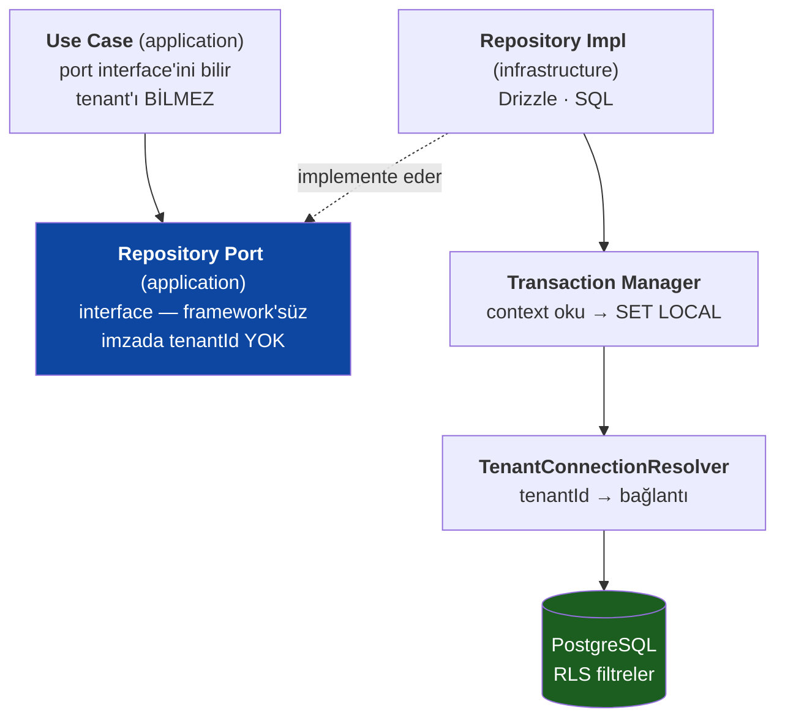
```mermaid
flowchart TD
    UC["<b>Use Case</b> (application)<br/>port interface'ini bilir<br/>tenant'ı BİLMEZ"]
    PORT["<b>Repository Port</b> (application)<br/>interface — framework'süz<br/>imzada tenantId YOK"]
    IMPL["<b>Repository Impl</b> (infrastructure)<br/>Drizzle · SQL"]
    TXM["<b>Transaction Manager</b><br/>context oku → SET LOCAL"]
    RES["<b>TenantConnectionResolver</b><br/>tenantId → bağlantı"]
    PG[("PostgreSQL<br/>RLS filtreler")]

    UC --> PORT
    IMPL -.->|"implemente eder"| PORT
    IMPL --> TXM --> RES --> PG

    style PORT fill:#0d47a1,color:#fff
    style PG fill:#1b5e20,color:#fff
```

Bağımlılık yönü **içeri doğrudur**: `infrastructure` → `application`. Use case, hangi veritabanında olduğunu bilmez.

### 13.3 Repository kuralları

| # | Kural | Gerekçe |
|---|---|---|
| 1 | Metot imzasında `tenantId` yok | [§13.1](#131-temel-sözleşme) |
| 2 | Repository **transaction açmaz** | Transaction sınırı use case'tedir; repository'nin açması iç içe transaction ve kısmi commit üretir |
| 3 | Ham havuz erişimi yok | Yalnızca transaction manager üzerinden bağlantı; lint kuralıyla zorlanır |
| 4 | Ham SQL yalnızca gerekçeli ve parametreli | String birleştirme **yasak**; SQL injection RLS'i de delebilir |
| 5 | Repository **domain nesnesi** döner, satır değil | Sızıntı yüzeyi ve katman ihlali önlenir |
| 6 | Modül kendi schema'sının dışına **yazmaz** | Modül sınırı kuralı (`CLAUDE.md` §5) |
| 7 | Cross-schema FK **yasak** | Referans `id` ile tutulur |
| 8 | `WHERE tenant_id = ?` **yazılmaz** | RLS zaten filtreler. Elle yazmak, RLS'in çalıştığı yanılsamasını gizler ve unutulduğunda kimse fark etmez |

> Kural 8'in nüansı: elle filtre yazmak *zararsız* görünür ama tehlikelidir — çünkü RLS bozulduğunda (yanlış rol, eksik `FORCE`) elle yazılmış filtreler hatayı maskeler ve testler yeşil kalır. RLS'in **tek** filtre olması, bozulduğunda görünür olmasını sağlar.

#### Kural 1'in istisnası: platform repository'leri

`§13.1`'in "imzada `tenantId` yok" kuralı, **tenant context'inin zaten kurulmuş olduğunu** varsayar. Platform tablolarına ([§12.4](#124-platform-tabloları--i̇stisna-listesi)) erişen repository'ler bu varsayımı sağlayamaz — çünkü context'i **kuracak olan** sorgu, context'e dayanamaz.

`TenantRepository` bunun kanonik örneğidir:

| Metot | Context neden yok |
|---|---|
| `findBySlug(slug)` | Tenant resolution sırasında çalışır ([§8.2](#82-çözüm-zinciri)) — context henüz kurulmadı |
| `save(tenant)` | Provisioning sırasında çalışır ([ADR-0016](../adr/0016-tenant-provisioning.md)) — tenant'ın kendi context'i yok |
| `existsBySlug(slug)` | Tenant sınırının **dışını** sorar: "bu slug başka birinde var mı?" RLS altında bu soru normal sorguyla yanıtlanamaz ([§12.4.1](#1241-tenant-resolution-i̇çin-kontrollü-rls-aşımı)) |

Bu bir kural ihlali **değildir**; kuralın kapsamadığı bir alandır. Ancak istisna sessiz kalmamalıdır:

- İstisna yalnızca **§12.4'teki platform tabloları** için geçerlidir. Bir iş modülünün repository'si bu gerekçeyi **kullanamaz**.
- Port dosyası, neden istisna olduğunu **yazılı gerekçesiyle** taşır.
- Context'in bulunmadığı çağrılar adapter tarafında `DEVELOPMENT_RULES.md` §4.4 gereği açıkça işaretlenir ve ayrıca review edilir.
- **Listeleme metodu yazılmaz.** `findAll()` benzeri bir metot, tüm tenant'ları döndüren tek satırlık bir sızıntı kapısıdır. Bu kural istisnanın da istisnası değildir — mutlaktır.

### 13.4 TenantConnectionResolver — Aşama 2'ye giden kapı

Tenant → bağlantı çözümü **tek bir yerde** soyutlanmıştır. Enterprise dedicated DB'ye geçişin tüm maliyeti bu adapter'dadır.

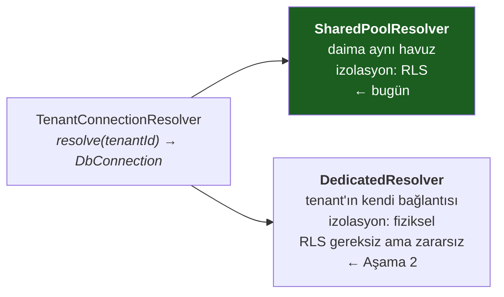
```mermaid
flowchart LR
    R["TenantConnectionResolver<br/><i>resolve(tenantId) → DbConnection</i>"]
    R --> S["<b>SharedPoolResolver</b><br/>daima aynı havuz<br/>izolasyon: RLS<br/>← bugün"]
    R --> D["<b>DedicatedResolver</b><br/>tenant'ın kendi bağlantısı<br/>izolasyon: fiziksel<br/>RLS gereksiz ama zararsız<br/>← Aşama 2"]

    style S fill:#1b5e20,color:#fff
```

Business logic hangi modda çalıştığını **bilmez**. Bu, Aşama 2'nin maliyetini bir adapter yazmaya indirger — [G4](#goals) hedefi budur.

---

## 14. Security Model

### 14.1 Tehdit modeli

| # | Tehdit | Etki | Önlem | Kalan risk |
|---|---|---|---|---|
| T1 | **Çapraz tenant veri okuma** | Kritik | RLS + `FORCE` + sahip olmayan rol + zorunlu testler | RLS dışı yollar ([§12.5](#125-rlsin-koruyamadığı-yollar)) |
| T2 | **Host/header manipülasyonu ile tenant değiştirme** | Kritik | Tenant kimliği yalnızca imzalı JWT claim'inden ([P1](#p1--tenant-kimliğinin-tek-meşru-kaynağı-doğrulanmış-jwt-claimidir)) | Token çalınması |
| T3 | **Token yeniden kullanımı / çalınmış token** | Yüksek | Kısa ömürlü access + refresh rotation; her istekte membership doğrulaması | Access token ömrü boyunca pencere |
| T4 | **Membership iptali sonrası erişimin sürmesi** | Yüksek | Membership her istekte kontrol edilir; cache TTL kısa ve iptalde açıkça invalidate | Cache TTL kadar pencere |
| T5 | **Tenant enumeration** (slug/domain tarama) | Orta | Var olmayan tenant ve yetkisiz tenant **aynı** 404'ü döner; rate limit | Zamanlama analizi |
| T6 | **Kullanıcı enumeration** (davet/login üzerinden) | Orta | Sabit yanıt ve sabitlenmiş yanıt süresi ([§7.3](#73-global-kimlik-ile-tenant-izolasyonunun-kesişimi)) | — |
| T7 | **Custom domain devralma** | Yüksek | TXT doğrulaması + periyodik yeniden kontrol ([§8.3](#83-custom-domain-doğrulaması)) | DNS kaydı sonradan silinirse gecikme penceresi |
| T8 | **Cache/storage/search üzerinden sızıntı** | Kritik | Tenant-prefix'li anahtar zorunluluğu; `SearchQuery.tenantId` zorunlu alan | Elle disiplin — test ile zorlanır |
| T9 | **Yetki yükseltme (tenant içi)** | Yüksek | Merkezî policy engine, deny-by-default; `owner` rolü değiştirilemez | RBAC dokümanının konusu |
| T10 | **Noisy neighbor / kaynak tüketimi** | Orta | Tenant + IP bazlı rate limit; sorgu zaman aşımı; plan kotaları | Paylaşılan DB'de doğal risk |
| T11 | **Arka plan işinin yanlış tenant'ta çalışması** | Kritik | Job context'i açıkça kurar; context'siz iş fail-closed | Payload'ın kaynağına güven |

### 14.2 Güvenlik değişmezleri (invariants)

Bunlar her zaman doğru olmalıdır. Biri yanlışsa üretim durdurulur.

| # | Değişmez |
|---|---|
| I1 | Uygulamanın bağlandığı DB rolü, tablo sahibi **değildir** ve `BYPASSRLS` **taşımaz** |
| I2 | Tenant-scoped her tablo `ENABLE` **ve** `FORCE ROW LEVEL SECURITY` ile korunur |
| I3 | Tenant-scoped her politikada hem `USING` hem `WITH CHECK` bulunur |
| I4 | `tenant_id` yalnızca doğrulanmış JWT claim'inden gelir |
| I5 | Tenant context olmadan hiçbir sorgu çalışmaz |
| I6 | `SET` (LOCAL'sız) kod tabanında **hiç geçmez** |
| I7 | Her cache anahtarı, storage anahtarı ve arama sorgusu tenant taşır |
| I8 | Tenant sınırını ilgilendiren her işlem audit kaydı üretir |
| I9 | Platform tablosu istisna listesi ([§12.4](#124-platform-tabloları--i̇stisna-listesi)) dışında tenant-scoped olmayan tablo yoktur |

> Bu değişmezlerden mekanik olarak doğrulanabilenler CI'da kontrol edilir. Doğrulanamayanlar code review kontrol listesindedir.

### 14.3 Audit

Tenant sınırını ilgilendiren her işlem `platform.audit_log`'a yazılır: tenant oluşturma/askıya alma/arşivleme, membership ekleme/rol değiştirme/iptal, domain ekleme/doğrulama, tenant değiştirme, **ve başarısız çapraz kontroller**.

Başarısız çapraz kontrol (Host ↔ claim uyuşmazlığı) özellikle önemlidir: tek başına zararsızdır ama **tekrarlanması** token çalınmasının veya aktif keşfin sinyalidir. Bu olay ayrıca alarm üretir.

Audit kayıtları immutable'dır: hiçbir role `UPDATE`/`DELETE` yetkisi verilmez.

---

## 15. Domain Events

Event mimarisinin genel kuralları ADR-0006 ve `ARCHITECTURE.md` §7'dedir. Burada tenant'a özgü olanlar tanımlanır.

### 15.1 Ortak sözleşme

Her event şunları taşır: `eventId` · `eventType` · `eventVersion` · **`tenantId`** · `occurredAt` · `correlationId` · `payload`.

> `tenantId` **zorunludur**. Tenant'a atfedilemeyen event yayınlanamaz ([P6](#p6--tenanta-atfedilemeyen-i̇şlem-yazılamaz)). Tek istisna, tenant'ın kendisinin henüz var olmadığı `UserRegistered` / `UserEmailVerified` event'leridir; bunlar `tenantId: null` taşır ve **yalnızca** Identity modülünde tüketilir.

Kurallar: isimler **geçmiş zaman** · event'ler immutable ve versiyonlanabilir · handler'lar **idempotent** (at-least-once) · yayın **transactional outbox** üzerinden.

### 15.2 Tenant modülü event'leri

| Event | Ne zaman | Tipik tüketiciler |
|---|---|---|
| `TenantProvisioningRequested` | Tenant kaydı oluşturuldu (`provisioning`) | Provisioning handler |
| `TenantProvisioned` | Provisioning tamamlandı (`active`) | Mail · analytics · billing |
| `TenantProvisioningFailed` | Provisioning başarısız (`failed`) | Alarm · temizlik işi |
| `TenantSuspended` | Askıya alındı | Oturum iptali · job durdurma |
| `TenantReactivated` | Yeniden aktif | Job yeniden başlatma |
| `TenantArchived` | Arşivlendi | Erişim kapatma · saklama sayacı |
| `TenantPurged` | Kalıcı olarak silindi | Storage/search/cache temizliği |
| `TenantSlugChanged` | Slug değişti | Cache/CDN invalidation |
| `TenantDomainVerified` | Custom domain doğrulandı | TLS sağlama · resolution cache |
| `MemberInvited` | Davet gönderildi | Mail |
| `MemberJoined` | Davet kabul edildi | Onboarding · analytics |
| `MemberRoleChanged` | Rol değişti | **Yetki cache invalidation** |
| `MemberSuspended` | Üyelik askıya alındı | Oturum iptali |
| `MemberRemoved` | Üyelik sonlandırıldı | Oturum iptali · yetki cache |

### 15.3 Güvenlikle bağlantılı event'ler

Bazı event'ler yalnızca bildirim değildir; **güvenlik etkisi vardır** ve handler'ları gecikmeye tolerans göstermez:

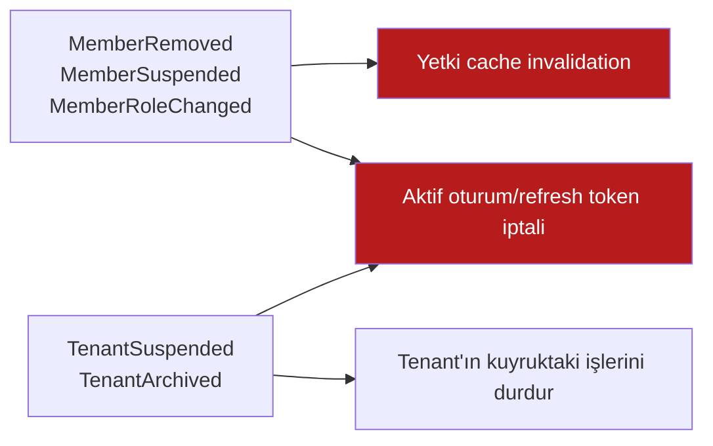
```mermaid
flowchart LR
    E1["MemberRemoved<br/>MemberSuspended<br/>MemberRoleChanged"] --> H1["Yetki cache invalidation"]
    E1 --> H2["Aktif oturum/refresh token iptali"]
    E2["TenantSuspended<br/>TenantArchived"] --> H2
    E2 --> H3["Tenant'ın kuyruktaki işlerini durdur"]

    style H1 fill:#b71c1c,color:#fff
    style H2 fill:#b71c1c,color:#fff
```

> **Bayat izin = güvenlik açığı.** Yetkisi kaldırılmış bir kullanıcının cache'lenmiş izinle çalışmaya devam etmesi kabul edilemez. Bu yüzden yetki cache'i kısa TTL taşır **ve** bu event'lerde açıkça invalidate edilir — ikisi birden, yalnızca biri değil.

### 15.4 Event'lerde tenant izolasyonu

- Bir event handler'ı **daima** event'in `tenantId`'si ile context açar.
- Bir handler birden fazla tenant'ın verisine **dokunamaz**.
- Outbox publisher tenant'lar arası okur (istisna listesinde) ama her event'i **kendi tenant context'inde** teslim eder.

---

## 16. Failure Handling

### 16.1 Temel ilke — fail closed

> Şüphe varsa **reddet**. Multi-tenant bir sistemde "emin değilim ama devam edeyim", "tüm tenant'ların verisini döndür" demektir.

### 16.2 Hata matrisi

| Durum | Yanıt | Loglama | Neden bu yanıt |
|---|---|---|---|
| JWT yok / geçersiz / süresi dolmuş | `401` | info | Standart kimlik doğrulama hatası |
| JWT geçerli, `tenant_id` claim'i yok | `401` | **warn** | Token yanlış üretilmiş — sistemsel hata sinyali |
| Host doğrulanmamış/bilinmeyen domain | `404` | info | Tenant varlığı sızdırılmaz |
| Host ↔ claim uyuşmazlığı | `403` | **⚠️ security** | Token çalınması veya keşif sinyali → alarm |
| Membership yok / `active` değil | `403` | warn | Üyeliğin varlığı sızdırılmaz |
| Tenant `suspended` | `403` + `problem.type: tenant-suspended` | info | İstemcinin doğru ekran gösterebilmesi için ayırt edilebilir |
| Tenant `archived` / `provisioning` | `403` | info | — |
| **Tenant context kurulamadı** | `500` | **error** | Bu bir istemci hatası değil, sistemsel hatadır. Asla filtresiz devam edilmez |
| RLS politika ihlali (DB hatası) | `500` | **⚠️ error + alarm** | Uygulama katmanı **bunu üretmemeliydi**. 403 dönmek hatayı normalleştirir |
| Slug/domain çakışması | `409` | info | Yarış koşulu DB kısıtından yakalanır |
| Provisioning başarısız | `202` verilmişti → durum `failed` | **error** | Asenkron; istemci durum sorgusuyla öğrenir |

> **RLS ihlalinin neden `500` olduğu** özellikle önemlidir: RLS'e takılan bir sorgu, uygulama katmanının **zaten engellemesi gereken** bir şeyi denediği anlamına gelir. `403` dönmek bunu "beklenen bir yetki hatası" gibi gösterir ve gerçek bir bug'ı gürültüye gömer. `500` + alarm, doğru sinyaldir.

### 16.3 Yanıt formatı

Tüm hatalar RFC 7807 (`application/problem+json`) formatındadır. Yanıt `traceId` **taşır**; stack trace, SQL, dosya yolu, tenant listesi veya başka bir tenant'a ait hiçbir bilgi **taşımaz**.

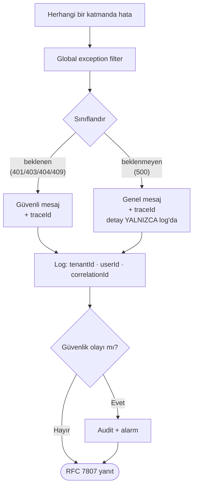
```mermaid
flowchart TD
    ERR["Herhangi bir katmanda hata"] --> F["Global exception filter"]
    F --> C{"Sınıflandır"}
    C -->|"beklenen<br/>(401/403/404/409)"| SAFE["Güvenli mesaj<br/>+ traceId"]
    C -->|"beklenmeyen<br/>(500)"| GEN["Genel mesaj<br/>+ traceId<br/>detay YALNIZCA log'da"]
    SAFE --> LOG["Log: tenantId · userId · correlationId"]
    GEN --> LOG
    LOG --> SEC{"Güvenlik olayı mı?"}
    SEC -->|Evet| AL["Audit + alarm"]
    SEC -->|Hayır| OUT(["RFC 7807 yanıt"])
    AL --> OUT
```

### 16.4 Kısmi başarısızlıklar

| Senaryo | Davranış |
|---|---|
| Provisioning yarıda kaldı | Tenant `failed` durumunda kalır; telafi işi kaydı temizler, slug serbest bırakılır. **Yarım tenant `active` olmaz.** |
| Outbox publisher çöktü | Event'ler outbox'ta bekler; publisher ayağa kalkınca kaldığı yerden devam eder. Handler'lar idempotent olduğu için tekrar teslim güvenlidir. |
| Cache düştü | Sistem **yavaşlar, çalışmaz hâle gelmez**. Cache'e bağımlı business logic yazılamaz. |
| Search index bayatladı | Arama eksik sonuç döner; index yeniden kurulabilir (türetilmiş veri). **PostgreSQL kaynak-of-truth'tur.** |
| Membership kontrolü için DB erişilemez | İstek **reddedilir**. Cache'lenmiş izinle devam etmek fail-open'dır. |
| Custom domain DNS kaydı kaldırıldı | Periyodik kontrol domain'i devre dışı bırakır; tenant subdomain'den erişilebilir kalır. |

### 16.5 Geri alma (rollback) duruşu

Tenant sınırını ilgilendiren migration'lar **geri alınabilir** olmalıdır ve RLS politikaları migration'ın **ayrılmaz parçasıdır**. Tablo bir migration'da, politikası başka bir migration'da olamaz — arada kalan pencere, korumasız bir tablodur.

---

## 17. Future Extensions

Bu bölüm gelecek çalışmaları kaydeder. **Hiçbiri bugün yapılmıyor.** Her biri gündeme geldiğinde ayrı bir ADR ile karara bağlanır.

### 17.1 Organization katmanı

**Tetikleyici:** Gerçek bir holding/çok-şirketli müşteri talebi.

`Tenant` üzerinde, birden fazla tenant'ı gruplayan bir `Organization` varlığı. Bugünkü model bunu **destekleyecek şekilde** hazırlanmıştır: `tenant_id` düz kaldığı için mevcut RLS politikaları değişmez; Organization yalnızca *üstte* bir gruplama ve çapraz-tenant *raporlama* katmanı olarak eklenir.

> Kritik kısıt: Organization eklendiğinde de **veri erişimi tenant sınırında kalmalıdır**. Organization, çapraz-tenant veri okuma yetkisi vermez; yalnızca yönetim ve toplu raporlama sağlar. Bu kısıt gevşetilirse tüm izolasyon modeli yeniden değerlendirilmelidir.

### 17.2 Dedicated database (Aşama 2)

**Tetikleyici:** Veri ikametgâhı, izole yedekleme veya uyumluluk talebi.

Bir tenant kendi veritabanına taşınır. `DedicatedResolver` devreye girer, business logic değişmez ([§13.4](#134-tenantconnectionresolver--aşama-2ye-giden-kapı)). Diğer tenant'lar paylaşılan modelde kalır — **ikisi aynı anda çalışır**.

Açık kalan sorular: migration hattının çok-veritabanlı hâle getirilmesi · tenant taşıma (shared → dedicated) prosedürü · yedekleme/geri yükleme operasyonu.

### 17.3 Çapraz tenant işbirliği

**Tetikleyici:** Tedarikçi–müşteri arasında belge/proje paylaşımı talebi.

V1'de **kesinlikle yoktur** ([N4](#non-goals-v1de-bilinçli-olarak-yapılmıyor)). Eklenirse, mevcut izolasyon modelini delerek değil, **açık ve denetlenen bir paylaşım varlığı** ile yapılır: paylaşılan kaynak, hedef tenant'ta ayrı ve süreli bir erişim kaydı doğurur. RLS politikası gevşetilmez.

> Bu, mimarinin en tehlikeli genişlemesidir. "Sadece şu tablo için politikayı gevşetelim" şeklinde yapılırsa izolasyon garantisi biter.

### 17.4 Diğer

| Genişleme | Tetikleyici | Not |
|---|---|---|
| **Tenant başına custom field'lar** | Ürün esneklik talebi | JSONB tabanlı; şema değişmez, RLS etkilenmez |
| **SSO / SAML / OIDC** | Kurumsal talep | Tenant başına kimlik sağlayıcı; federasyon bir port arkasında (ADR-0004'ün öngördüğü genişleme) |
| **SCIM ile kullanıcı sağlama** | Kurumsal talep | Membership'lerin otomatik senkronizasyonu |
| **Tenant başına şifreleme anahtarı (BYOK)** | Uyumluluk talebi | Sütun bazlı şifreleme; anahtar yönetimi ayrı bir port |
| **Tenant taşıma / birleştirme** | M&A senaryosu | Operasyonel araç; `tenant_id` yeniden yazma gerektirir, dikkatli tasarım ister |
| **Bölgesel yerleşim (data residency)** | AB/ABD veri ikametgâhı | Bölge başına ayrı deployment; resolution katmanı bölge-farkında hâle gelir |
| **Tenant başına kota ve rate limit ayarı** | Plan farklılaşması | Faz 6 faturalama ile birlikte |

### 17.5 Agent ekosistemi — tenant sınırı açısından

Ajan ekosisteminin ve marketplace katmanının **vizyonu** bu dokümanın kapsamı dışındadır ([§2](#2-scope)); `ARCHITECTURE.md` §13'te kayıtlıdır. Buraya yalnızca **multi-tenancy'yi ilgilendiren kısıt** yazılmıştır, çünkü uygulanacağı yer burasıdır.

**Tetikleyici:** AI katmanı olgunlaştığında ve iş modülleri veri üretmeye başladığında. Bugün yapılmıyor.

**Kısıt:** Ajanlar arası (agent-to-agent) iletişim, uygulama katmanının altından geçen **yeni bir veri yoludur** ve RLS'in doğal olarak korumadığı bir yüzeydir — cache, storage ve arama indeksiyle aynı kategoride ([§12.5](#125-rlsin-koruyamadığı-yollar)).

Bu genişleme gündeme geldiğinde:

- Her ajan çağrısı bir **tenant context'i altında** çalışmalıdır ([§11](#11-asynclocalstorage-context-flow)) — context'siz ajan, context'siz job ile aynı şekilde fail-closed olur.
- Ajanlar arası her mesaj `tenantId` **taşımalıdır**; taşımayan mesaj iletilmez.
- İki farklı tenant'ın ajanı **hiçbir koşulda** aynı bağlamı, aynı hafızayı veya aynı konuşma durumunu paylaşmaz.
- Ajan çıktısının önbelleklenmesi, [§12.5](#125-rlsin-koruyamadığı-yollar)'in tenant-prefix'li anahtar kuralına tabidir.

> **Mevcut model gevşetilmez.** "Ajanlar zaten aynı sistemin parçası, aralarında izolasyona gerek yok" gerekçesi bu dokümanın reddettiği şeydir. Ajanlar arası paylaşım, [§17.3](#173-çapraz-tenant-i̇şbirliği)'teki çapraz tenant işbirliğiyle aynı kategoridedir ve aynı disiplinle ele alınır.

---

## Ek A — Geliştirici kontrol listesi

Tenant verisine dokunan bir modül yazıyorsanız, PR açmadan önce:

- [ ] Her tablo `tenant_id uuid NOT NULL` taşıyor
- [ ] Her tabloda `ENABLE` **ve** `FORCE ROW LEVEL SECURITY` var
- [ ] Her politikada hem `USING` hem `WITH CHECK` var
- [ ] Politikalar tabloyla **aynı** migration'da
- [ ] Unique kısıtlar tenant-scoped (`UNIQUE(tenant_id, …)`)
- [ ] Index'lerde `tenant_id` ilk kolon
- [ ] Repository imzalarında `tenantId` parametresi **yok**
- [ ] Sorgularda elle `WHERE tenant_id = ?` **yok**
- [ ] Repository transaction açmıyor
- [ ] Cache anahtarları `t:<tenantId>:…` formatında
- [ ] Storage anahtarları `tenants/<tenantId>/…` formatında
- [ ] Arama sorguları `tenantId` taşıyor
- [ ] Yayınlanan her event `tenantId` taşıyor
- [ ] Arka plan işleri context'i açıkça kuruyor
- [ ] **İzolasyon testleri yazıldı ve geçiyor** ([§12.6](#126-zorunlu-i̇zolasyon-testi) — 6 madde)
- [ ] Yeni bir platform (tenant-scoped olmayan) tablo eklenmediyse ✓; eklendiyse [§12.4](#124-platform-tabloları--i̇stisna-listesi) güncellendi **ve** mimari onay alındı

---

## Ek B — Terimler

| Terim | Anlam |
|---|---|
| **Tenant** | İzolasyon, faturalama ve yönetim sınırı — bir şirket |
| **Membership** | Bir kullanıcının bir tenant içindeki üyeliği; rol ve durumu taşır |
| **Tenant context** | Bir isteğin/işin çalıştığı tenant kimliği; `AsyncLocalStorage`'da yaşar, persist edilmez |
| **Resolution** | Gelen isteğin hangi tenant'a ait olduğunun belirlenmesi |
| **Provisioning** | Yeni bir tenant'ın oluşturulup kullanıma hazır hâle getirilmesi |
| **RLS** | Row Level Security — PostgreSQL'in satır bazlı erişim denetimi |
| **`FORCE RLS`** | Politikaların tablo sahibi rol için de uygulanmasını zorlayan ayar |
| **Fail closed** | Belirsizlik durumunda erişimi reddetme duruşu |
| **Hint** | Host'tan türetilen, güvenilmeyen tenant ipucu |
| **Claim** | Doğrulanmış JWT içindeki alan — tenant kimliğinin tek meşru kaynağı |

---

## Değişiklik geçmişi

| Sürüm | Tarih | Değişiklik |
|---|---|---|
| 1.0 | 2026-07-21 | İlk sürüm — Faz 2 girişi. ADR-0012…0016 `Planned` olarak referanslandı. |
| 1.1 | 2026-07-21 | ADR-0012…0016 yazıldı, referanslar `Kabul edildi` olarak güncellendi. §12.1 düzeltmesi: rol isimleri kanonik hâle getirildi (`businessos_owner` / `businessos_app`), var olmayan üçüncü rol kaldırıldı, `NOBYPASSRLS` ile `FORCE` arasındaki ayrım netleştirildi. |
| 1.2 | 2026-07-21 | §7.5 eklendi — Role modeli (domain'de value object, persistence'ta enum). ADR-0014 ile doküman arasındaki sapma kapatıldı. |
| 1.3 | 2026-07-21 | §13.3'e "Kural 1'in istisnası: platform repository'leri" alt bölümü eklendi. §7.2 düzeltmesi: `revoked → active` yerine `revoked → invited` — diyagramın etiketi ("yeniden davet edildi") ile hedefi çelişiyordu. |
| 1.4 | 2026-07-21 | §17.5 eklendi — agent ekosisteminin tenant sınırı kısıtı. Vizyonun kendisi `ARCHITECTURE.md` §13'te. |
| 1.5 | 2026-07-21 | §12.4.1 eklendi — tenant resolution ile `platform.tenants` RLS politikası arasındaki çelişki çözüldü: `SECURITY DEFINER` çözüm fonksiyonu ve `FORCE`'un neden bu tabloda bulunmadığı. İlk implementasyonda ortaya çıkan gerçek bir boşluktu. |
| 1.6 | 2026-07-21 | §12.4.1'e `existsBySlug` notu ve §9.3'e nezaket kontrolunun transaction icinde oldugu eklendi — ikisi de implementasyonun ortaya cikardigi sonuclar. |
| 1.7 | 2026-07-21 | §12.4.2 eklendi — outbox standart RLS kullanir; publisher'in okuma yolu icin ucuncu bir DB rolu yerine kontrollu asim fonksiyonu kullanilacagi karara baglandi (henuz uygulanmadi). |
